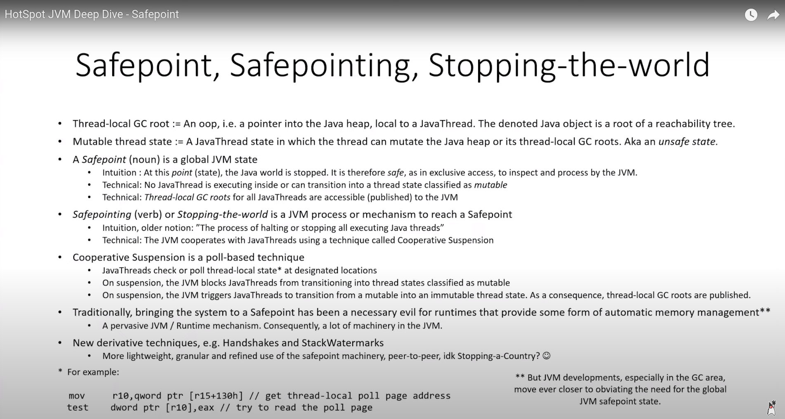
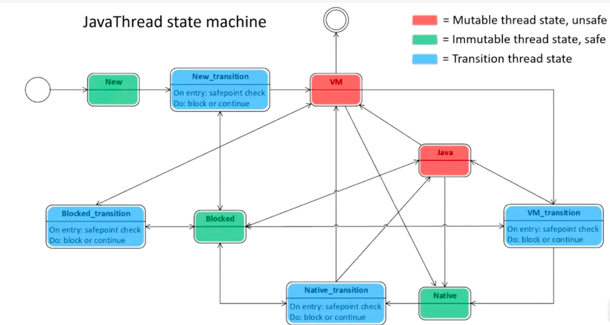

# SafePoint
## 摘要
全局JVM状态 、 VM中Java线程状态(004.OpenJDK(JVM)学习/002.JVM内核/001.VMThread模块.md) 、 test指令、轮询页面、信号处理函数、在VM状态下只有少数地方显式地执行安全点检查、发布GC Root、恢复Java线程执行 、主动暂停

## 名词释义
+ Mutable Thread State(可变线程状态)<sup>有时被称为 不安全状态 </sup>: 一种java线程状态，特指可以改变java堆的线程状态。

## 什么是SafePoint
许多可提供某种形式的自动内存管理的运行时使用的一种非常普遍且特定的技术。

&nbsp;&nbsp;名词上是一个全局JVM状态，这里直观概念是在这个点或状态下，Java世界停止了.所以他是安全的，因为所有其他应用线程停止了，这样JVM可以独占检查和处理。更技术性的定义是没有Java线程在内部执行或可以转到可变线程状态。技术定义的另一部分是所有Java线程的本地GC根都可以访问或发布到JVM。

## 什么是 safepointing
动词，也被称为 Stop The World , 是JVM到达一个安全点的过程或机制。

## 安全点&VM_Operation关系(JVM G1源码分析与调优)
1. 当需要STW时，都会产生一个VM_Operation,并把这个放入到VMThread队列中，VMThread会循环处理这个队列里面的请求。
```c
 // 005.OpenJDK/002.OpenJDK8u312-GA/OpenJDK8U312-GA/hotspot/src/share/vm/runtime/vmThread.cpp
 void VMThread::loop() {
  // ...
  while(true) {
        // ....

        // 进入安全点
        SafepointSynchronize::begin();

        // 执行VMOperation
        evaluate_operation(_cur_vm_operation);

        // Complete safepoint synchronization： 退出安全点
        SafepointSynchronize::end();

        // ...
  }
}
```
### Safepoint,Safepointing,Stoping-The-World


## 协作挂起技术
&nbsp;&nbsp;协作挂起技术-合作暂停是一种基于轮询的技术，这意味着Java线程将在VM中的指定位置检查或轮训线程本地状态，在暂停时，JVM会阻止Java线程转换为可变线程状态，并且在暂停时，JVM会触发Java线程从可变状态转换为不可变线程状态，并且由于这种转换，线程本地GC根将被发布。但是安全点给程序运行带来了运行时延迟和不确定性。

在GC领域，更接近于消除对全局JVM状态的需要。

线程握手和线程栈水位线使得安全点机制可以更轻量级或更精细化。

## 将系统带到安全点的过程
## Java Thread state machine


  - 可变线程状态(Mutable Thread state,unsafe): 是一种可以改变Java堆或其线程本地GC根的状态
  - 不可变线程状态(Immutable Thread state,safe): 不能改变Java堆或其线程本地GC根的状态.
  - 过渡状态(Transition Thread state): 可变状态和不可变状态之间的桥梁,转换状态`具有安全点检查或轮询指令以及适当的防护`。
    + Native状态下执行的代码被认为是安全的，意味着Java线程实际上可以继续运行native代码，这意味着与安全点涉及阻塞或停止所有Java线程的直接概念相悖，这只意味着他们不会在敏感的可变状态下执行。

&nbsp;&nbsp;该过程由从VMThread请求安全点操作的客户端启动，他通过将VM_Operation类型的对象排入队列并将其属性evaluate_at_safepoint()设置为true来实现，VM_Thread将等待出队并启动安全点过程以服务提交的请求，这是VM_Thread运行的第一部分。他由三部分组成:
1. arming the java Thread.(武装Java线程)
   ```txt
      arming本质上意味着VMThread更改了安全点检查中使用的轮询页面的内存保护（SafepointMechanism::ThreadData）

      VMTrhread武装了轮询页面，即他将内存保护从PAGE_READONLY 更改为 PAGE_NO_ACCESS , 硬件将报非法访问或者segmentation fault , 这会通知操作系统，反过来通知寄存器信号或异常处理器。
      
      Hotspot VM会向各自操作系统注册信号处理程序，以获取有关此类事件的通知，利用硬件和操作系统提供的信息，我们可以确定发生了什么事件，并且还提供了有关哪个指令导致他的信息，以及尝试的内存地址，所以，在信号处理器中可以确定内存地址是安全点轮询页面，因此，我们知道这个非法访问或segmentation fault不是真正的崩溃，而是与合作暂停有关。

      我们保存save_exception_pc(错误指令地址)的java线程字段中的指令，操作系统还提供了处于trap时的状态的CPU上下文，使得可以再信号处理器中重写CPU上下文。也就是说可以修改指令指针(IP: instruction pointer) 而不是指向补货他的原始Java代码，而是执向特殊的StubRoutine。当线程在展开所有异常处理程序后恢复时，操作系统重新加载这个现在修改的CPU上下文，并且线程继续在指定的StubRoutine中运行，而不是在原来的java代码中运行。
   ```
2. synchronizing with that is waiting for all java threads.(同步，即等待所有java线程)
3. when all threads are considered safe that is the global jvm safepoint state has been reached the VMThread then runs the submitted operation.(当所有线程都被认为是安全的，即已经达到全局JVM安全点状态时，VMThread 然后运行提交的操作)

&nbsp;&nbsp;JVM阻止Java线程转变到被归类为可变的线程状态： arming 本质上意味着VMThread更改了安全点检查中使用的所谓轮询页面的内存保护，将他从内存保护状态PAGE_READONLY 更改为 PAGE_NOACCESS,即已经完成了武装了Java线程的投票页，他有效地删除了线程转换到任何红色不安全可变状态的能力，VM_Thread通过这个进城所做的事情意味着现在状态机制被替换成了一个临时的状态机制，然而，这只是合作暂停的一部分。

&nbsp;&nbsp;JVM触发Java线程从在可变状态变为不可变状态，作为这个转换线程的结果，本地GC根(Thread Local GC Root)被发布，_last_java_frame是发布到JVM重要部分，因为他提供了遍历栈的入口，如何确保那些已经在可变状态下运行的线程变为不可变状态：
- 对于在VM状态下运行的线程，他需要等待，直到线程自己执行转换。在VM状态下只有少数地方显式地执行安全点检查，例如，当争用VM下的互斥锁或监视器时。
- 在Java状态的线程(编译线程,JIT编译执行Java线程)，不能像在VM状态一样，等待Java中的线程自行过渡，如一个线程可以执行无限循环，这是完全合法的，在这种状态下，永远无法到达安全点。因此，需要一种适当的机制来疏散或退出当前运行Java代码的线程。JIT编译器在常规代码流中插入了安全点检查或轮询指令，他由两个指令组成： 1:从驻留在r15中的Java线程加载轮询页面的指针;2:执行test(或cmp,解除对轮询页面的引用),Safepoint 检查由编译器插入到循环头中，以便获取长时间的循环，还有在方法返回之前。test指令尝试解除对他从寄存器中(r15)加载的轮询页面的引用，但如果VMThread武装了轮询页面，即将内存保护状态PAGE_READONLY 更改为 PAGE_NOACCESS，硬件将报非法访问或Segmentation Fault,这又会通知操作系统，之后反过来通知寄存器信号或者异常处理程序，Hotspot JVM将向各自的操作系统注册信号处理程序，以获取有关此类事件的通知。利用硬件和操作系统提供的信息，可以确定发生了什么事件以及具体信息。所以在信号处理程序内部可以确定内存地址是安全点轮询页面，所以知道这种非法访问或者Segmentation Fault并不是真正的崩溃，但他与合作暂停有关，我们保存被困在名为saved_exception_pc的Java线程字段中的指令，操作系统还为我们提供了处于trap时的状态的CPU上下文（保存了报异常的指令地址和CPU上下文信息，后面恢复执行会用到），我们现在可以在信号处理程序中重写CPU上下文，也就是可以修改指令指针(IP,Instruction Pointer)指向特定的StubRoutine,而不是执行捕获他的原始Java代码，当线程展开所有异常处理程序后恢复时，操作系统重新加载这个现在修改的CPU上下文，并且线程继续在指定的StubRoutine中运行，而不是在原来的Java代码中运行，StubRoutine 负责将这个特定线程的CPU上下文和堆栈导出到VM，当我们最终进入VM操作时，将Java线程的线程状态字段设置为阻塞，连同Full Fence完全内存屏障指令，这对于线程本地GC根可见或发布到VM非常重要，线程现在将等待全局信号量，在VM线程运行VM操作后，他发出信号量以及当线程恢复的时候，他将解除自己的轮询页并从中断的地方继续执行。
- 解释执行线程如何进入安全点?
  ```txt
    JVM 提供了一个正常指令派发表DispatchTable，还提供了一个异常指令派发表;需要进入安全点的时候，JVM会用异常指令派发表替换这个正常指令派发表。那么当前字节码指令执行完毕之后在执行下一条字节码指令时就会进入到异常指令派发表。异常指令派发表中所有的TOS(栈顶状态缓存)都会去执行InterpreterRuntime::at_safepoint();,最终进入安全点。
  ```


## 源代码索引
1. JavaThread: 005.OpenJDK/002.OpenJDK8u312-GA/OpenJDK8U312-GA/hotspot/src/share/vm/runtime/thread.hpp

## 重要字段记录
```c
  // 005.OpenJDK/002.OpenJDK8u312-GA/OpenJDK8U312-GA/hotspot/src/share/vm/runtime/thread.hpp
  /**
   * _thread_state： 跟踪Java线程正在执行代码的哪一部分
   * 
   */ 
  volatile JavaThreadState _thread_state;


   // 005.OpenJDK/002.OpenJDK8u312-GA/OpenJDK8U312-GA/hotspot/src/share/vm/runtime/safepoint.hpp
   /**
    *  "Polling Page Safepoint"（轮询页面安全点）
    *  Polling Page Safepoint：线程在执行过程中会定期检查轮询页面的状态，以确定是否需要进入安全点。这种机制通常用于长时间运行的循环或代码块中，确保线程不会长时间不响应安全点请求。
    * 
    *  Poll Return Safepoint（轮询返回安全点）是在线程从本地方法返回到Java代码时检查是否需要进入安全点。
    */
    volatile bool _at_poll_safepoint;  // At polling page safepoint (NOT a poll return safepoint)
```

## 哪些地方会用到safepoint
> 学习:[safepoint-001-782909118-1-16.mp4](./safepoint-001-782909118-1-16.mp4) 

- 垃圾回收（GC）
-  代码优化与反优化
   + JIT 编译器在优化或反优化代码时，需要线程到达 Safepoint，以确保代码状态一致。
- 线程状态检查
   + JVM 在检查线程状态（如线程是否阻塞或等待）时，需要线程到达 Safepoint。
- 偏向锁撤销
   + 当撤销偏向锁时，JVM 需要线程到达 Safepoint，以确保锁状态一致。
- 线程转储


## 如果有一段代码进不了安全点怎么办?
JVM会通过设置一个中断标志，各个线程在执行过程中不断轮询这个标志。一旦发现中断标志为真，线程会在最近的安全点上主动中断挂起。这样确保了即使某些代码片段没有安全点，垃圾收集也能顺利进行‌


## 参考资料
1. [深入理解SafePoint-上](./safepoint-001-782909118-1-16.mp4)
2. [深入理解SafePoint-下](./safepoint-002-782909122-1-16.mp4)
3. [深入剖析Java虚拟机（基础卷）](../../006.BOOKs/深入剖析Java虚拟机（基础卷）.epub)

## 其他
1. 将安全点定义为全局JVM状态时
2. 所有Java线程的线程本地GC根都可以访问或发布到JVM

## Java Thread Local GC Roots
### 1. Local JNI Handles
 _active_handles Java线程字段 , 是一个本地jni句柄，提供给在native状态下运行的jni代码对应的oop的间接访问，但是在分配解除分配甚至取消jni句柄首先会执行native->VM状态转换，这将进行安全点检查。

### 2. HandleArea
_handle_area 提供与jni句柄几乎相同的间接功能，这些是针对于在VM状态下运行的代码，这些区域不是自动管理的，必须由程序员手动管理。

HandleMark用于描述句柄范围

### 3. Last Java Frame
_anchor , 线程内部结构体，由三个指针组成:
- _last_java_sp； 最后一个Java堆栈指针
- last_java_pc: 最后一个Java程序计数器
- last_java_fp: 最后一个Java帧指针

#### OopMap
为了精准定位帧中的oop，OopMap使用栈指针的相对地址或RegisterMap的索引的相对地址来描述位置，并非所有代码代码位置都有OopMap，他们主要与调用点和安全点轮询页面指令相关联。

对于堆栈遍历，每帧的返回地址都将与一个OopMap相关联，

### 4. JavaThread CPU Context
执行Java代码的线程也有一个cpu上下文，根据调用约定和性能的原因，理想情况下，oops由寄存器分配器直接放入寄存器内，HotSpot广泛使用Stubs 或 StubRoutines （基于特定平台的特殊程序集帮助程序：一个重要特性就是 在线程暂停他的工作让出CPU的时候保存CPU上下文，并且在线程回归执行的时候恢复CPU上下文） ， registerMap用于将oop映射描述的位置解析为寄存器，

## 将系统带到安全点的过程
该过程由从VMThread请求安全点操作的客户端启动，他通过将VM_Operation类型的对象入队并将其属性evaluate_at_safepoint设置为true来实现 ， VMTread将等待出队并启动安全点过程以服务提交的请求。


## VMThread is the coordinator(协调员)
```c
void VMThread::loop();
```

---

## 如何确保已经在可变状态下运行的线程变为不可变状态
> 
### 对于VM状态下运行的线程
- 对于在VM状态下运行的线程，他需要等待，直到线程自己执行切换。在VM状态中只有少数几个地方显式地执行安全点检查。这种设计的前提是Java线程应该在VM状态中花费尽可能少的时间。

### Java状态下运行的线程
不能像VM状态那样处理，等待Java状态的线程自动行过渡<sub>（如：一个线程可以执行无线循环，在这种情况下，JVM永远不会到达安全点。因此，需要有一种适当的机制来疏散或退出当前运行的Java线程来解决这个问题）</sub>


## 源码记录
+ 遍历所有的JavaThread
  ```txt
    # 005.OpenJDK/007.OpenJDK21-GA/OpenJDK21-GA/src/hotspot/share/runtime/threadSMR.hpp#`class JavaThreadIteratorWithHandle` 
    用法: 
    # 005.OpenJDK/007.OpenJDK21-GA/OpenJDK21-GA/src/hotspot/share/runtime/safepoint.cpp
   for (JavaThreadIteratorWithHandle jtiwh; JavaThread *cur = jtiwh.next(); ) {
       // Make sure the threads start polling, it is time to yield.
       SafepointMechanism::arm_local_poll(cur);
   }
  ```

模板解释器是如何工作的，通过断点调试：
1. 执行入口在哪里
2. 字节码执行之前会做哪些逻辑
3. 字节码执行返回会做哪些逻辑

