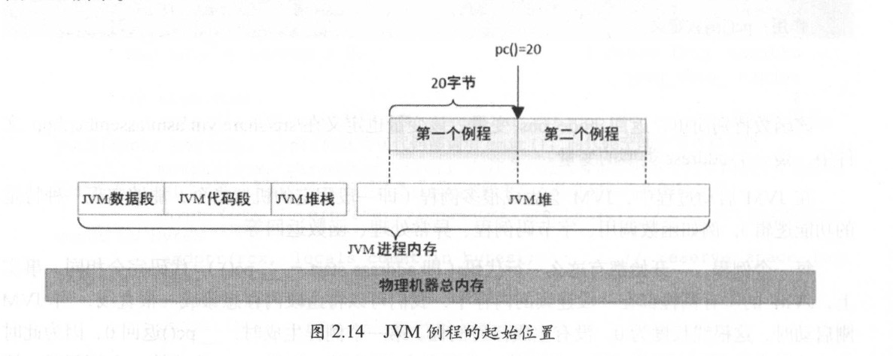

# JVM 例程
> 先阅读:[006.BOOKs/Unlocking-The-Java-Virtual-Machine/002.Unlocking-The-Java-Virtual-Machine-2.pdf](../../006.BOOKs/Unlocking-The-Java-Virtual-Machine/002.Unlocking-The-Java-Virtual-Machine-2.pdf) P75 

```c
// 005.OpenJDK/002.OpenJDK8u312-GA/OpenJDK8U312-GA/hotspot/src/share/vm/runtime/javaCalls.cpp
      // 通过分析 call_stub 来认识JVM例程
      StubRoutines::call_stub()(
        (address)&link,
        // (intptr_t*)&(result->_value), // see NOTE above (compiler problem)
        result_val_address,          // see NOTE above (compiler problem)
        result_type,
        method(),
        entry_point,
        args->parameters(),
        args->size_of_parameters(),
        CHECK
      );

// 005.OpenJDK/002.OpenJDK8u312-GA/OpenJDK8U312-GA/hotspot/src/share/vm/runtime/stubRoutines.hpp
   static CallStub call_stub() { return CAST_TO_FN_PTR(CallStub, _call_stub_entry); }

```

在JVM启动的过程中，JVM会生成很多`例程`<sup>**即一段固定的机器指令，能够实现一种特定的功能逻辑**</sup>(_call_stub_entry就是其中一个)，例如 函数调用、字节码例程、异常处理、函数返回等

JVM的例程都写入JVM的堆内存中，在JVM初始化时，会初始化一个容量足够大的堆内存，例程会写入堆中靠近起始的位置。当Java程序开始运行后，JVM将Java类对象实例陆续写入到堆内存中。



