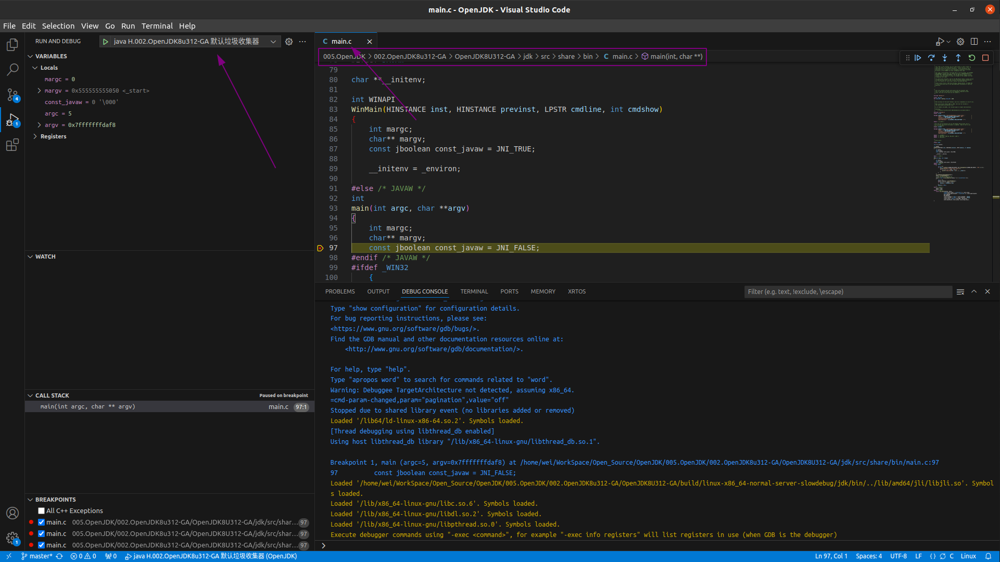
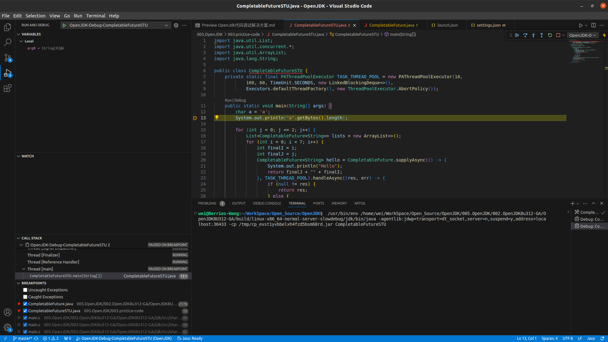
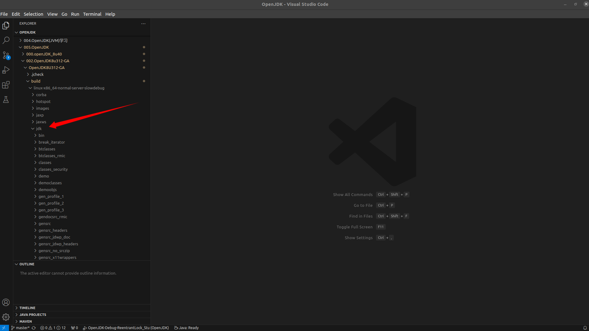
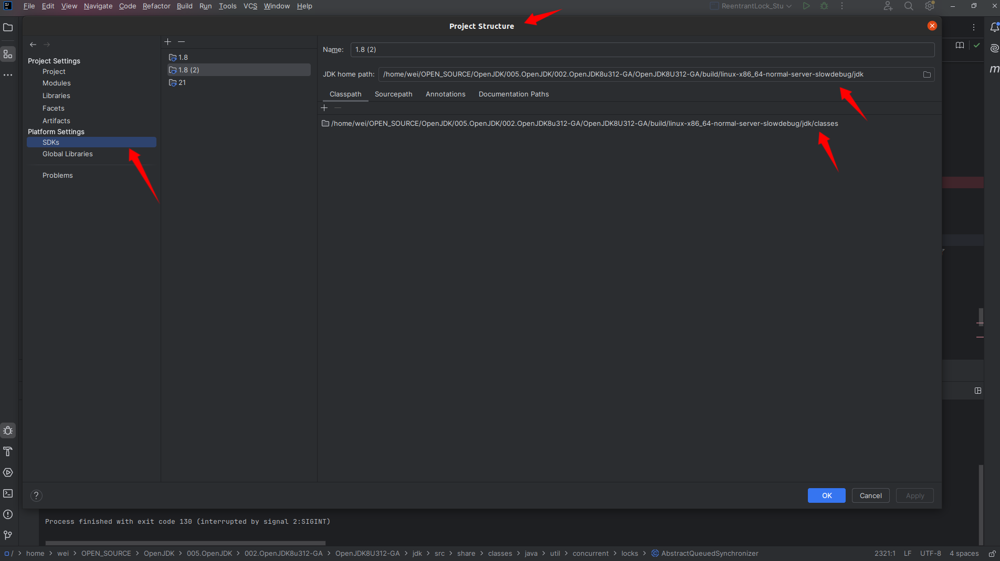
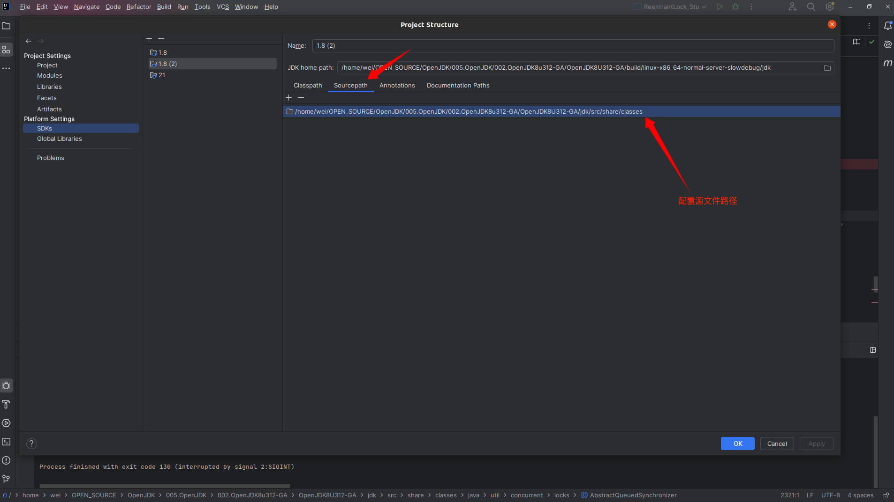
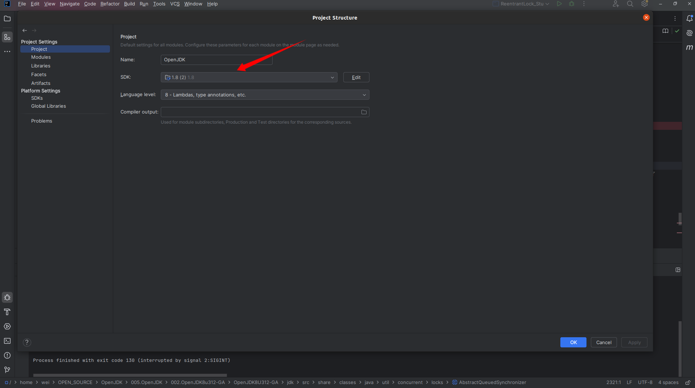
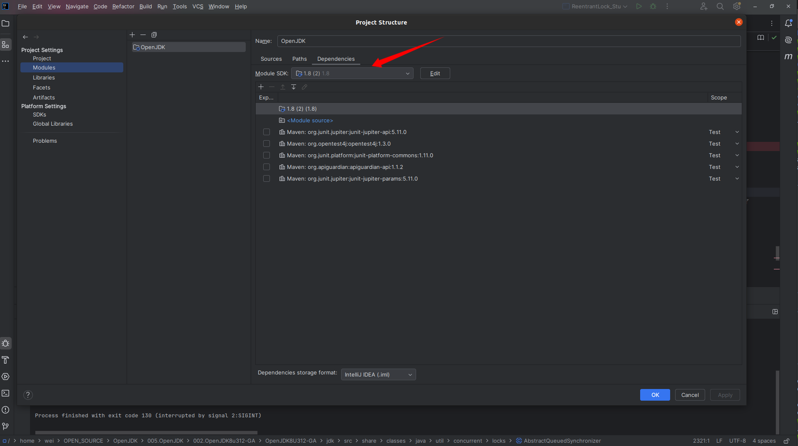
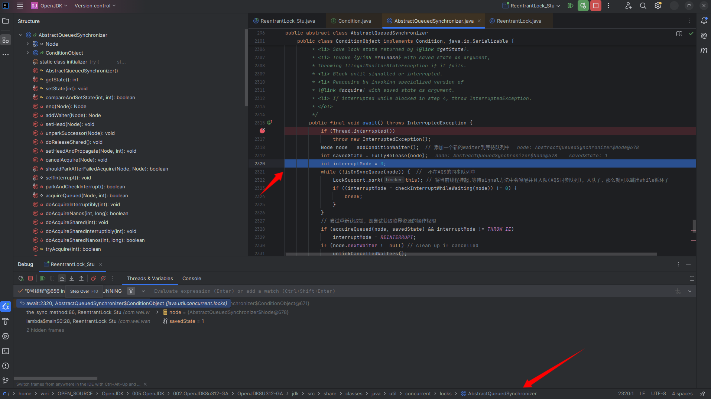

# OpenJDK代码Debug
## GDB命令行调试 
OpenJdk使用GDB调试问题以及解决方案
## 问题一: openjdk gdb 导致segment fault 不gdb就没问题
+ 具体的错误信息: Thread 2 "java" received signal SIGSEGV, Segmentation fault.
   - 调试命令: gdb --args ./linux-x86_64-normal-server-slowdebug/jdk/bin/java D
       - D: 由D.java编译(${workspaceFolder}/005.OpenJDK/000.openJDK_8u40/build/linux-x86_64-normal-server-slowdebug/jdk/bin/javac -g D.java)而来的class文件
+ 解决方案: [(gdb) handle SIGSEGV nostop noprint pass](./DOCS.WEI/使用%20GDB%20调试%20JDK-Debugging%20the%20JDK%20with%20GDB.pdf) & [Troubleshooting Guide for Java SE 6 with HotSpot VM#Reasons for Not Getting a Core File](./DOCS.WEI/Troubleshooting%20Guide%20for%20Java%20SE%206%20with%20HotSpot%20VM.pdf)
    ```txt
      Java specific: If the process received SIGSEGV or SIGILL but no core dump, it is possible that the process handled it. For example, HotSpot VM uses the SIGSEGV signal for legitimate purposes, such as throwing NullPointerException, deoptimization, and so forth. The signal is unhandled by the Java VM only if the current instruction (PC) falls outside Java VM generated code. These are the only cases in which HotSpot dumps core.特定于 Java：如果进程收到了 SIGSEGV 或 SIGILL，但没有收到核心转储，则可能是该进程处理了它。例如，HotSpot VM 将 SIGSEGV 信号用于合法目的，例如引发 NullPointerException、去优化等。仅当当前指令 （PC） 不在 Java VM 生成的代码范围内时，Java VM 才会不处理该信号。这些是 HotSpot 转储 core 的唯一情况。
    ```

------------------

## VSCode可视化调试
launch.json配置
&nbsp;&nbsp;在005.OpenJDK/000.openJDK_8u40/build下有D.java源文件，内容如下:
```java
   public class D {

    public static void main(String[] args) {

        System.out.println("Hello WOrld");

    }

   }
```

&nbsp;&nbsp;现使用vscode进行调试(注意，要使用源码构建出的javac,java命令进行调试)，编译命令如下:
+ 编译: ${workspaceFolder}/005.OpenJDK/000.openJDK_8u40/build/linux-x86_64-normal-server-slowdebug/jdk/bin/javac -g D.java

&nbsp;&nbsp;launch.json配置如下:
```json
{
            "name": "java JitStu.002.OpenJDK8u312-GA",
            "type": "cppdbg",
            "request": "launch",
            "program": "${workspaceFolder}/005.OpenJDK/002.OpenJDK8u312-GA/OpenJDK8U312-GA/build/linux-x86_64-normal-server-slowdebug/jdk/bin/java",
            "args": [ // 为什么这么指定VM options，请参看 man java的输出
                //"-XX:+UseG1GC", // 启用G1
                // "-XX:GCLogLevel=finest", // 实验选项,需要打开-XX:+UnlockExperimentalVMOptions,从而获取更为详细的日志信息
                // "-XX:+UnlockExperimentalVMOptions",
                "-XX:+UseParNewGC",
                "-XX:+UseConcMarkSweepGC",
                //"-XX:+TraceBiasedLocking", // 追踪偏向锁信息,默认为false
                "-XX:+PrintWeiLog", // 是否打印自定义日志
                "-XX:-PrintCompilation", // 输出被编译方法的统计信息，因此使用PrintCompilation可以很方便的看出哪些是热点代码
                "-XX:+UnlockCommercialFeatures",
                "-XX:+FlightRecorder", // JDK8 配置
                //开启JMC服务端口
                "-Dcom.sun.management.jmxremote.rmi.port=1099",
                "-Dcom.sun.management.jmxremote=true",
                "-Dcom.sun.management.jmxremote.port=1099",
                "-Dcom.sun.management.jmxremote.ssl=false",
                "-Dcom.sun.management.jmxremote.authenticate=false",
                "-Dcom.sun.management.jmxremote.local.only=false",
                "-Xms100M",
                "-Xms100M",
                "JitStu"
            ],
            "stopAtEntry": false,
            "cwd": "${workspaceFolder}/005.OpenJDK/003.prictice-code",
            // 设置环境变量
            "environment": [
                {
                    "name": "_JAVA_LAUNCHER_DEBUG",
                    "value": "OFF"  // 是否开启调试模式： ON:开启；OFF:关闭
                }
            ],
            "externalConsole": false,
            "MIMode": "gdb",
            "setupCommands": [
                {
                    "description": "为 gdb 启用整齐打印",
                    "text": "-enable-pretty-printing",
                    "ignoreFailures": true
                }
            ],
            "osx": {
                "MIMode": "lldb",
                "internalConsoleOptions": "openOnSessionStart",
            },
            "linux": {
                "MIMode": "gdb",
                "setupCommands": [
                    {
                        "text": "handle SIGSEGV noprint nostop",
                        "description": "Disable stopping on signals handled by the JVM"
                    }
                ]
            }
        }
```

### 调试JVM
> 具体配置详见 launch.json

>> main.c 中的main方法就是jvm启动入口

### 调试JDK
> 具体配置详见 launch.json


### 使用idea调试OpenJDK: 宛如调试一般JDK一样:断点、局部变量、...
##### 1. 源码编译


##### 配置idea
1. 添加自编译OpenJDK: 注意jdk路径和源文件路径
- 
- 

2. 项目和模块都配置新添加的OpenJDK
- 
- 

##### 开始调试
- 
-----------------

## 调试注意事项
1. 注意构建脚本(005.OpenJDK/000.openJDK_8u40/openJdkBuild.sh)参数ZIP_DEBUGINFO_FILES，设置了这个参数会生成debuginfo信息(如：libjvm.debuginfo、libjsig.debuginfo)，才可以打断点进行调试