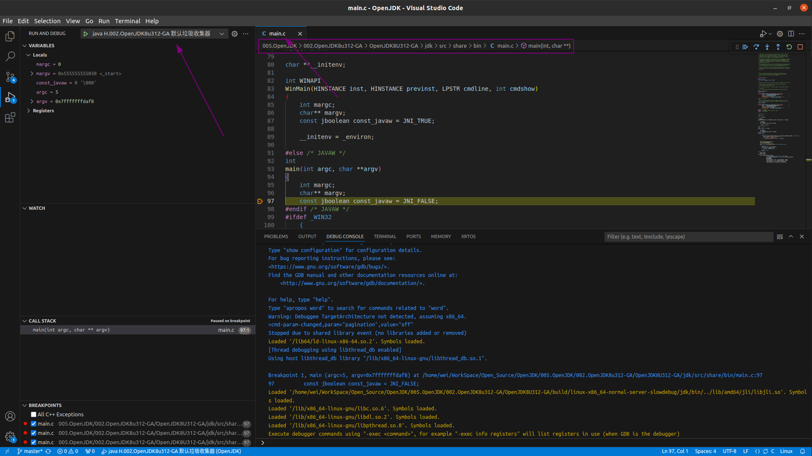
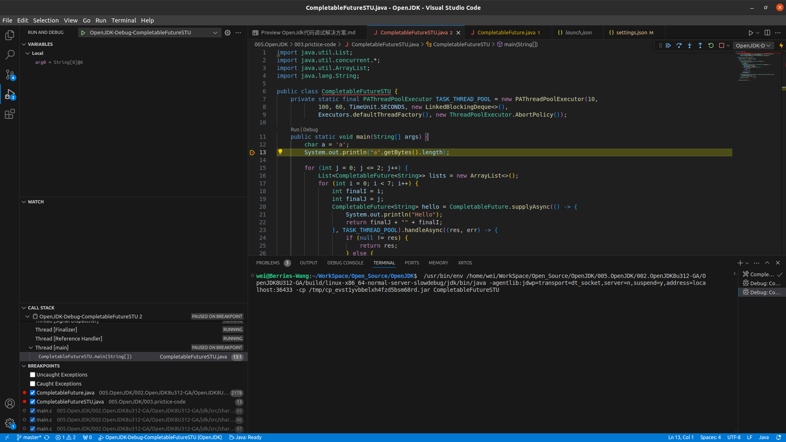

# OpenJDK代码Debug
## GDB命令行调试 
OpenJdk使用GDB调试问题以及解决方案
## 问题一: openjdk gdb 导致segment fault 不gdb就没问题
+ 具体的错误信息: Thread 2 "java" received signal SIGSEGV, Segmentation fault.
   - 调试命令: gdb --args ./linux-x86_64-normal-server-slowdebug/jdk/bin/java D
       - D: 由D.java编译(${workspaceFolder}/005.OpenJDK/000.openJDK_8u40/build/linux-x86_64-normal-server-slowdebug/jdk/bin/javac -g D.java)而来的class文件
+ 解决方案: [(gdb) handle SIGSEGV nostop noprint pass](https://www.zhihu.com/question/39925554)

------------------

## VSCode可视化调试
launch.json配置
&nbsp;&nbsp;在005.OpenJDK/000.openJDK_8u40/build下有D.java源文件，内容如下:
```java
   public class D {

    public static void main(String[] args) {

        System.out.println("Hello WOrld");

    }

   }
```

&nbsp;&nbsp;现使用vscode进行调试(注意，要使用源码构建出的javac,java命令进行调试)，编译命令如下:
+ 编译: ${workspaceFolder}/005.OpenJDK/000.openJDK_8u40/build/linux-x86_64-normal-server-slowdebug/jdk/bin/javac -g D.java

&nbsp;&nbsp;launch.json配置如下:
```json
{
            "name": "java JitStu.002.OpenJDK8u312-GA",
            "type": "cppdbg",
            "request": "launch",
            "program": "${workspaceFolder}/005.OpenJDK/002.OpenJDK8u312-GA/OpenJDK8U312-GA/build/linux-x86_64-normal-server-slowdebug/jdk/bin/java",
            "args": [ // 为什么这么指定VM options，请参看 man java的输出
                //"-XX:+UseG1GC", // 启用G1
                // "-XX:GCLogLevel=finest", // 实验选项,需要打开-XX:+UnlockExperimentalVMOptions,从而获取更为详细的日志信息
                // "-XX:+UnlockExperimentalVMOptions",
                "-XX:+UseParNewGC",
                "-XX:+UseConcMarkSweepGC",
                //"-XX:+TraceBiasedLocking", // 追踪偏向锁信息,默认为false
                "-XX:+PrintWeiLog", // 是否打印自定义日志
                "-XX:-PrintCompilation", // 输出被编译方法的统计信息，因此使用PrintCompilation可以很方便的看出哪些是热点代码
                "-XX:+UnlockCommercialFeatures",
                "-XX:+FlightRecorder", // JDK8 配置
                //开启JMC服务端口
                "-Dcom.sun.management.jmxremote.rmi.port=1099",
                "-Dcom.sun.management.jmxremote=true",
                "-Dcom.sun.management.jmxremote.port=1099",
                "-Dcom.sun.management.jmxremote.ssl=false",
                "-Dcom.sun.management.jmxremote.authenticate=false",
                "-Dcom.sun.management.jmxremote.local.only=false",
                "-Xms100M",
                "-Xms100M",
                "JitStu"
            ],
            "stopAtEntry": false,
            "cwd": "${workspaceFolder}/005.OpenJDK/003.prictice-code",
            // 设置环境变量
            "environment": [
                {
                    "name": "_JAVA_LAUNCHER_DEBUG",
                    "value": "OFF"  // 是否开启调试模式： ON:开启；OFF:关闭
                }
            ],
            "externalConsole": false,
            "MIMode": "gdb",
            "setupCommands": [
                {
                    "description": "为 gdb 启用整齐打印",
                    "text": "-enable-pretty-printing",
                    "ignoreFailures": true
                }
            ],
            "osx": {
                "MIMode": "lldb",
                "internalConsoleOptions": "openOnSessionStart",
            },
            "linux": {
                "MIMode": "gdb",
                "setupCommands": [
                    {
                        "text": "handle SIGSEGV noprint nostop",
                        "description": "Disable stopping on signals handled by the JVM"
                    }
                ]
            }
        }
```

### 调试JVM
> 具体配置详见 launch.json

>> main.c 中的main方法就是jvm启动入口

### 调试JDK
> 具体配置详见 launch.json


-----------------

## 调试注意事项
1. 注意构建脚本(005.OpenJDK/000.openJDK_8u40/openJdkBuild.sh)参数ZIP_DEBUGINFO_FILES，设置了这个参数会生成debuginfo信息(如：libjvm.debuginfo、libjsig.debuginfo)，才可以打断点进行调试