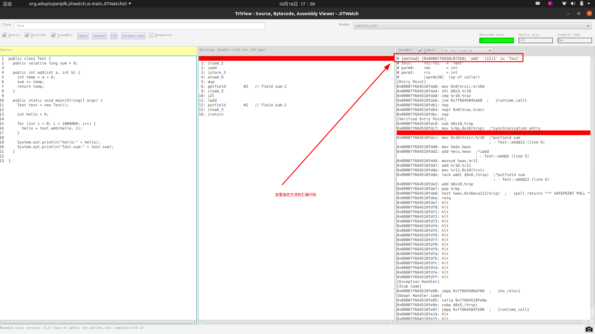

# 如何将Java代码变为汇编代码
#### Step1. 下载源文件
- [https://sourceforge.net/projects/fcml/files/fcml-1.1.3/](https://sourceforge.net/projects/fcml/files/fcml-1.1.3/)
   - 即代码工具下的文件: fcml-1.1.3.tar.gz

#### Step2. 安装
1. 下载源码并解压
2. 切换到目标目录
3. ./configure && make && sudo make install
4. cd example/hsdis && make && sudo make install
5. sudo cp libhsdis.so ${JDK PATH}/lib/amd64/hsdis-amd64.so
6. sudo cp libhsdis.so ${JDK PATH}/jre/lib/amd64/hsdis-amd64.so

#### Step3. 使用
>使用javac编译，得到class文件
>运行，使得JIT产生机器代码: java -server -XX:+UnlockDiagnosticVMOptions -XX:+TraceClassLoading  -XX:+PrintAssembly -XX:+LogCompilation -XX:LogFile=jit.log  ${Your_Class_Name}

#### Step5. 分析工具
- JITWatch:[https://github.com/AdoptOpenJDK/jitwatch](https://github.com/AdoptOpenJDK/jitwatch)
- 使用JITWatch打开并分析 Step3产生的jit.log文件
- 
- 更多请参考官方文档

#### 注意事项
1. 需要一个足够复杂的类，让JIT编绎器认为它需要进行优化，不然产生的日志可能没什么内容。如下代码可以: 
    ```java
       public class Test {
	public volatile long sum = 0;
	
	public int add(int a, int b) {
		int temp = a + b;
		sum += temp;
		return temp;
	}
 
	public static void main(String[] args) {
		Test test = new Test();
 
		int hello = 0;
 
		for (int i = 0; i < 1000000; i++) {
			hello = test.add(hello, 1);
		}
 
		System.out.println("hello:" + hello);
		System.out.println("Test.sum:" + test.sum);
	}

   }
    ```