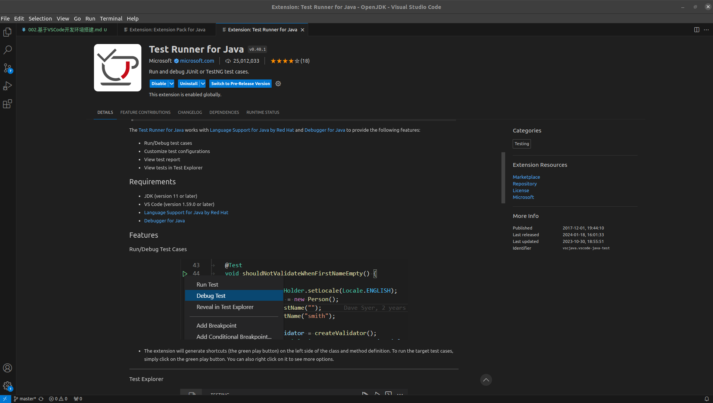

# 搭建基于VSCode的开发环境
&nbsp;&nbsp;哪那么多理由，直接开整

## 插件安装
1. [Extension Pack for Java](https://marketplace.visualstudio.com/items?itemName=vscjava.vscode-java-pack)
   + 包含以下插件:
      - IntelliCode
      - Project Manager for Java
      - Maven for Java
      - Test Runner for Java
      - Debugger for Java
      - Language Support for Java(TM) by Red Hat
      - 
2. [XML](https://marketplace.visualstudio.com/items?itemName=redhat.vscode-xml)
   - 

## 插件配置
### 配置 Language Support for Java(TM) by Red Hat
&nbsp;&nbsp;通过在VSCode中(如下图)或在[Language Support for Java(TM) by Red Hat](https://marketplace.visualstudio.com/items?itemName=redhat.java)官方网站可以查看插件功能以及配置项，通过配置插件，达到自定义开发环境的目的。
- 

### 配置插件JDK
&nbsp;&nbsp;通过插件文档，可以发现，"The tooling JDK will be used to launch the Language Server for Java. And by default, will also be used to compile your projects. Java 17 is the minimum required version."： 文档说明，需要最低版本JDK运行该插件，查找顺序为: JDK_HOME环境变量 -> JAVA_HOME变量 -> 系统路径

### 配置项目JDK
&nbsp;&nbsp;另外，需要配置编译项目的JDK，通过 java.configuration.runtimes  来配置:
```json
    # settings.json
    "java.configuration.runtimes": [
        {
            "name": "JavaSE-1.8",
            "path": "/home/wei/WorkSpace/open_source/OpenJDK/005.OpenJDK/002.OpenJDK8u312-GA/OpenJDK8U312-GA/build/linux-x86_64-normal-server-slowdebug/jdk",
            "sources": "/home/wei/WorkSpace/open_source/OpenJDK/005.OpenJDK/002.OpenJDK8u312-GA/OpenJDK8U312-GA/jdk/src/share/classes",
            "default": true
        }
    ]
```

### 插件命令
- 插件插件提供的命令: 
- 使用插件提供的命令(Ctrl + Shift + p打开命令面板): 
  + 

### VSCode 配置
+ java.jdt.ls.java.home ：  Absolute path to JDK home folder used to launch the Java Language Server. Requires VS Code restart.
  - 配置运行该插件的JDK，绝对路径
  ```json
      # settings.json
     "java.jdt.ls.java.home": "/home/wei/WorkSpace/TempLibs/jdk21/jdk-21.0.1"
  ```

---
### Test Runner for Java
&nbsp;&nbsp;通过文档：可以发现，该插件需要最低:JDK11来运行该插件.

#### 插件配置:
&nbsp;&nbsp;通过入口:，可以发现插件配置,配置运行该插件的JDK：
```json
   "java.test.config": {
        "javaExec": "/home/wei/WorkSpace/TempLibs/jdk21/jdk-21.0.1/bin/java"
    },
```