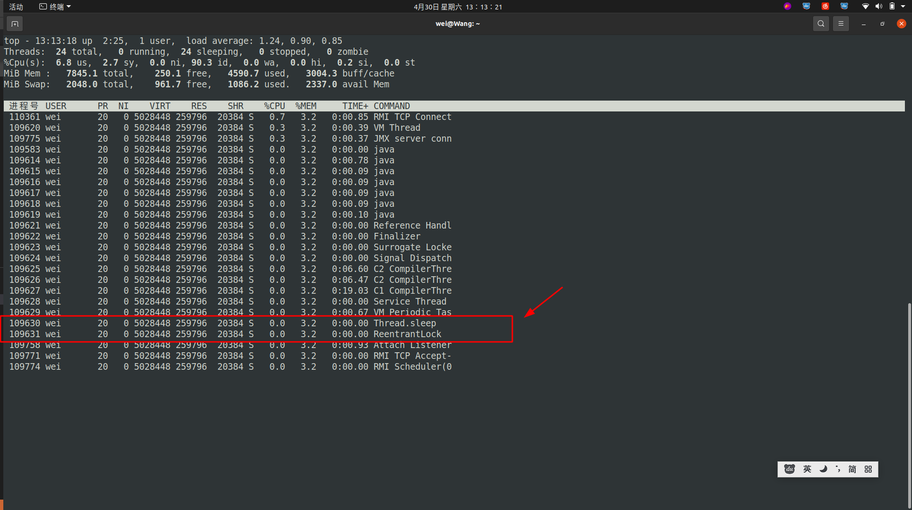
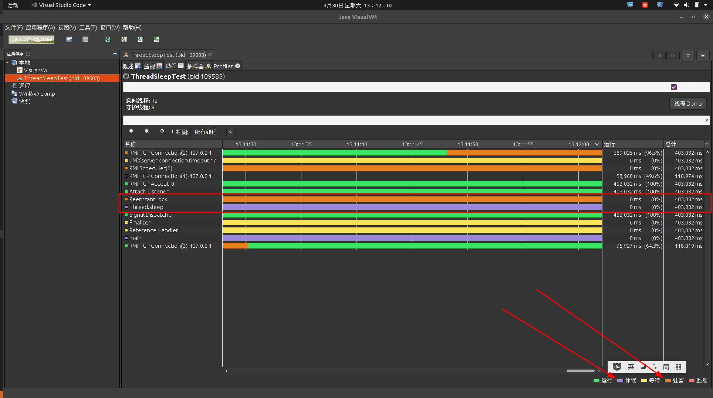

# Thread.sleep(x) 与 LockSupport#park(Obj)
## 总结
&nbsp;&nbsp; Thread.sleep(x) 相比于 LockSupport#park(Obj) 是更耗费CPU资源的,这似乎并不正确，通过测试代码: [005.OpenJDK/002.OpenJDK8u312-GA/OpenJDK8U312-GA/build/ThreadSleepTest.java]来分析(同一个代码,运行10分钟之后)：
+ 从OS(操作系统)的角度
  - 
+ 从JVM的角度
  - 
+ 系统信息
  ```txt
      Ubuntu20.04
      内核版本: 
      wei@Wang:~$ uname -a
      Linux Wang 5.13.0-40-generic #45~20.04.1-Ubuntu SMP Mon Apr 4 09:38:31 UTC 2022 x86_64 x86_64 x86_64 GNU/Linux

      从上述截图可以看出，Thread.sleep(x) 与 LockSupport#park(Obj) 导致线程挂起之后，均不会占用CPU执行时间。但是线程状态不同:
        从JVM角度:
           Thread.sleep(x): TIMED_WAITING , 限期等待
           LockSupport#park(Obj): WAITING , 无限期等待
        从OS角度:
           两者都是:S(sleeping)

   另外: 
     1. int pthread_cond_timedwait(pthread_cond_t *cond, pthread_mutex_t *mutex, const struct timespec *abstime);
      该函数第三个参数，很多文章上写的是绝对时间，修改系统时间会导致提前唤醒，但是测试(不论是基于系统启动时间还是当前系统时间)并没有提前唤醒(环境如上),不排除是内核版本的问题。通过文件[005.OpenJDK/002.OpenJDK8u312-GA/OpenJDK8U312-GA/hotspot/src/os/linux/vm/os_linux.cpp]可以发现，该绝对时间的计算方式有两种:
        1. 基于系统的启动时间 (此种情况没有被唤醒可以理解)
        2. 基于当前系统时间来计算 (此种情况没有被唤醒，不能理解，难道系统修复了这个bug吗)

  ```


## 分析
&nbsp;&nbsp;探索Thread.sleep(x) 与 LockSupport#park(Obj)之间的不同

### Thread.sleep(x)
```java
    /**
     * Causes the currently executing thread to sleep (temporarily cease
     * execution) for the specified number of milliseconds, subject to
     * the precision and accuracy of system timers and schedulers. The thread
     * does not lose ownership of any monitors.
     * <p>
     * 根据系统计时器和调度器的精度和准确性，使当前执行的线程在指定的毫秒数内处于睡眠状态(暂时停止执行)。线程不会失去任何监视器的所有权。
     *
     * @param millis the length of time to sleep in milliseconds
     * @throws IllegalArgumentException if the value of {@code millis} is negative
     * @throws InterruptedException     if any thread has interrupted the current thread. The
     *                                  <i>interrupted status</i> of the current thread is
     *                                  cleared when this exception is thrown.
     */
    public static native void sleep(long millis) throws InterruptedException;

    // 最终调用使用"os::sleep"来实现sleep逻辑( 005.OpenJDK/002.OpenJDK8u312-GA/OpenJDK8U312-GA/hotspot/src/share/vm/prims/jvm.cpp#JVM_ENTRY(void, JVM_Sleep(JNIEnv* env, jclass threadClass, jlong millis));)


     // 通过代码探索，发现Thread.sleep(x) 是调用函数 
    int pthread_cond_timedwait(pthread_cond_t *cond, pthread_mutex_t *mutex, const struct timespec *abstime);
      // # 005.OpenJDK/002.OpenJDK8u312-GA/OpenJDK8U312-GA/hotspot/src/os/linux/vm/os_linux.cpp 可以看这个源码：compute_abstime 计算绝对时间(看系统，可以是绝对时间，可以是相对于系统启动时间的绝对时间)
     // 来暂停线程的。man page信息如下:
       // atomically unlocks mutex and waits on cond, as pthread_cond_wait does, but it also bounds the duration of the wait. If cond has  not  been signaled  within the amount of time specified by abstime, the mutex mutex is re-acquired and pthread_cond_timedwait returns the error ETIMEDOUT.  The abstime parameter specifies an absolute time, with the same origin as time(2) and gettimeofday(2): an abstime of 0 corresponds to 00:00:00 GMT, January 1, 1970.

    // 通过源代码可知，Thread.sleep(x) 底层调用逻辑如下:
    // pthread_mutex_lock -> pthread_cond_timedwait(等待指定时间，从而达到sleep功能) -> pthread_mutex_unlock
```

### LockSupport#park(Obj)
&nbsp;&nbsp;该方法主要是通过调用“sun.misc.Unsafe#park”来实现的，因此，需要了解“sun.misc.Unsafe#park(boolean,long)”方法的逻辑，该方法是native方法，对应的cpp代码:"005.OpenJDK/002.OpenJDK8u312-GA/OpenJDK8U312-GA/hotspot/src/share/vm/prims/unsafe.cpp"中。通过解读代码，可以发现，LockSupport#park(Obj)通过如下C函数来调用的。
  ```c
    // 《UNIX 环境高级编程·第3版》
    // pthread man 手册安装 $: sudo apt-get install glibc-doc manpages-posix manpages-posix-dev
    // LockSupport#park(Obj) : 调用顺序: pthread_mutex_trylock -> pthread_cond_wait
    int pthread_mutex_trylock(pthread_mutex_t *mutex);
    // behaves identically to pthread_mutex_lock, except that it does not block the calling thread if the  mutex  is  already  locked  by  another thread (or by the calling thread in the case of a ``fast'' mutex). Instead, pthread_mutex_trylock returns immediately with the error code EBUSY.
    //  尝试对互斥量进行加锁，如果调用时互斥量处于未加锁的状态，则pthread_mutex_trylock将锁住互斥量，不会出现阻塞直接返回0.

    int pthread_cond_wait(pthread_cond_t *cond, pthread_mutex_t *mutex);
    // pthread_cond_wait atomically unlocks the mutex (as per pthread_unlock_mutex) and waits for the condition variable cond to be signaled. The  thread  execution  is  suspended  and  does  not  consume  any  CPU  time  until  the  condition  variable  is  signaled.  The mutex must be locked by the calling thread on entrance to  pthread_cond_wait. Before returning to the calling thread, pthread_cond_wait re-acquires mutex (as per pthread_lock_mutex). 
    // 线程被暂停且不会消耗任何CPU
    // 调用者将锁住的互斥量传递给函数，函数然后自动把调用线程放到等待条件的线程列表上，对互斥量进行解锁。  这就关闭了条件检查和线程进行休眠状态等待条件这两个操作之间的时间通道，这样就不会错过条件的任何变化。 pthread_cond_wait返回时，互斥量再次被锁住.

    // LockSupport#unpark
    int pthread_mutex_lock(pthread_mutex_t *mutex);
    // locks  the given mutex. If the mutex is currently unlocked, it becomes locked and owned by the calling thread, and pthread_mutex_lock returns immediately. If the mutex is already locked by another thread, pthread_mutex_lock suspends the calling thread until the mutex is unlocked.
    // 对互斥量加锁，即加锁

    int pthread_cond_signal(pthread_cond_t *cond);
    // pthread_cond_signal  restarts  one of the threads that are waiting on the condition variable cond. If no threads are waiting on cond, nothing happens. If several threads are waiting on cond, exactly one is restarted, but it is not specified which.
    // 唤醒一个等待该条件的线程。


    int pthread_mutex_unlock(pthread_mutex_t *mutex);
    // unlocks the given mutex. The mutex is assumed to be locked and owned by the calling thread on entrance to pthread_mutex_unlock. If the mutex is of the ``fast'' kind, pthread_mutex_unlock always returns it to the unlocked state. If it is of the ``recursive'' kind, it decrements the locking count of the mutex (number of pthread_mutex_lock operations performed on it by the calling thread), and only when this count reaches zero is the mutex actually unlocked.
    // 对互斥量解锁，即释放锁
  ```

---
## 线程中断和挂起方式的关系
&nbsp;&nbsp;在AQS中，当线程被唤醒时，会返回线程的中断状态,因为AQS中被阻塞的线程无法响应中断。那么线程中断是什么?与线程挂起方式有什么区别呢?

---

## 参考资料
1. OpenJDK1.8
2. 《UNIX 环境高级编程·第3版》