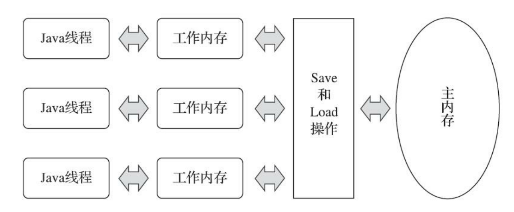
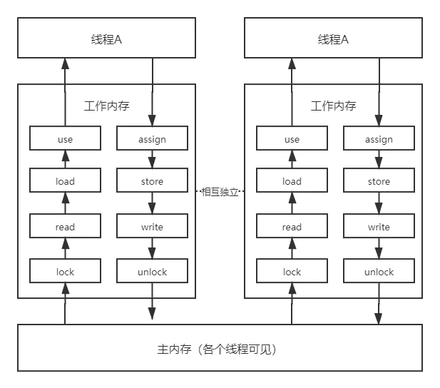
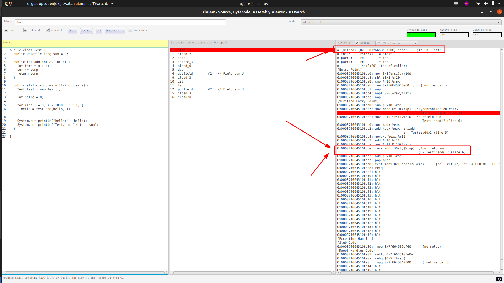

# Java内存模型 与 volatile
## 总结
1. 内存模型
    - 主内存,工作内存与线程的关系
    - 工作内存中存储的是主内存变量值的副本，线程与工作内存交互，不与主内存交互
    - 8个原子操作
2. Volatile
    - 涉及的汇编指令 lock , addl
    - long , double 的非原子性协定
---
## Java内存模型
&nbsp;&nbsp;《Java虚拟机规范》定义了一种 “Java内存模型” 来屏蔽各种硬件和操作系统的内存访问差异，以实现让Java程序在各种平台下都能达到一致的内存访问效果。

### 主内存与工作内存
&nbsp;&nbsp;Java内存模型(JMM,Java Memory Model)的主要目的是定义程序中各种"变量"<sup>指实例字段、静态变量和构成数组对象的元素，但是不包括局部变量和方法参数，因为局部变量和方法参数是线程私有的，不会被共享，因此不会有竞争问题</sup>的访问规则：
  1. > 在虚拟机中把变量值存储到内存中
  2. > 从内存中取出变量值

&nbsp;&nbsp;为了执行性能，JMM没有限制执行引擎使用处理器的特定寄存器或缓存来和主内存进行交互，也没有限制即时编译器是否要进行调整代码执行顺序这类优化措施。

#### >> 规定
1. >JMM规定了所有的变量都存储在主内存中，
2. >线程的工作内存中保存了该线程使用的变量的主内存**副本**
    - 线程对变量所有的操作(读取、赋值等)都必须在工作内存中进行，而不能直接读写主内存中的数据。
    - 不同的线程之间也无法直接访问对方工作内存中的变量，**线程间变量的值的传递均需要通过主内存来完成**

#### 线程、工作内存、主内存关系示意图
- 

##### 注意
1. 这里说的主内存与“堆、栈、方法区等”并不是同一个层次对内存的划分，这两者基本上没有任何的关系。

#### 内存间的交互
&nbsp;&nbsp;主内存和工作内存之间具体的交互协议，即一个变量如何从主内存拷贝到工作内存中，如何从工作内存同步回主内存这一类的实现细节。

&nbsp;&nbsp;JMM内存模型定义了以下8种操作<sup>不是指令</sup>来完成，Java虚拟机实现时必须保证下面提及的每一种操作都是原子的、不可再分的<sup>double和long类型的变量特殊，该两类变量的load、store、read、write操作在某些平台上允许有例外</sup>
1. lock
   + >作用于主内存的变量，将一个变量标识为一条线程独占的状态(互斥锁定)
2. unlock
   + > 作用于主内存的变量，将一个处于锁定状态的变量释放出来，释放后的变量才能被其他变量锁定
3. read
   + >作用于主内存的变量，将一个变量的值从主内存传输到线程的工作内存中，便于随后的load动作使用
4. load
   + >作用于工作内存的变量，将read操作从主内存得到的变量值放入到工作内存的**变量副本**中
5. use
   + >作用于工作内存的变量，将工作内存中的一个变量值传递给执行引擎，每当虚拟机遇到一个需要使用变量值的字节码指令时将会执行该操作
6. assign
   + >作用于工作内存的变量，将一个从执行引擎接收的值赋给工作内存的变量，每当虚拟机遇到一个给变量赋值的字节码指令时执行这个操作
7. store
   + >作用于工作内存的变量，将工作内存中一个变量值传送到主内存中，便于随后的write操作使用。
8. write
   + >作用于主内存的变量，将store操作从工作内存得到的变量值写入到主内存的变量中。

##### 交互示意图
- 

---
## volatile(针对于valatil型变量的特殊规则)
&nbsp;&nbsp;volatile关键字是Java虚拟机提供的最轻量的同步机制。

&nbsp;&nbsp;Java内存模型为volatile专门定义了一些特定的访问规则，因此他具有两项特性：
### volatile 特性之 可见性
&nbsp;&nbsp;可见性是指当一条线程修改了这个变量的值，新值对于其他线程来说是可以立即得知的。

>> 误区： “volatile变量对所有线程是立即可见的，对volatile变量所有的写操作都能立刻反映到其他线程之中。换句话说，volatile变量在各个线程中是一致的，所以基于volatile变量的运算在并发下是线程安全的”   >>> 这句话论据部分正确，但是结论并不正确
>>> 原因: volatile变量在各个线程的工作内存中是不存在一致性问题的（从物理存储的角度看，各个线程的工作内存中volatile变量也可以存在不一致的情况，但由于每次使用之前都要先刷新，执行引擎看不到不一致的情况，因此可以认为不存在一致性问题），但是Java里面的运算操作符并非原子操作<sup>问题1</sup>，这导致volatile变量的运算在并发下一样是不安全的
>>>> "问题1"原因: 一行Java代码可能对应多条字节码指令，一条字节码指令又可能需要执行引擎执行多行代码来实现。又或者是编译执行，一行Java代码也可能转换为若干条本地机器码指令。

#### 可见性注意事项
&nbsp;&nbsp;由于volatile只能保证可见性，在不符合如下两条规则的情况下仍然需要通过加锁来保证原子性: 
1. 运算结果并不依赖变量的当前值，或者能够确保只有单一的线程修改变量的值
2. 变量不需要参与其他的状态变量共同参与不变约束。
3. 应用示例： 当shutdown()方法被调用时，能保证所有线程中执行的doWork方法都立即停止下来
   ```java
        volatile boolean shutdownRequested;

        public void shutdown(){
            shutdownRequested = true;
        }

        public void doWork(){
            while(!shutdownRequested){
                // 代码业务逻辑
            }
        }
   ```

### volatile 特性之 禁止指令重排序
#### Java代码
```java
public class Test {
	public class Test {
	public volatile long sum = 0;
	
	public int add(int a, int b) {
		int temp = a + b;
		sum += temp;
		return temp;
	}
 
	public static void main(String[] args) {
		Test test = new Test();
 
		int hello = 0;
 
		for (int i = 0; i < 1000000; i++) {
			hello = test.add(hello, 1);
		}
 
		System.out.println("hello:" + hello);
		System.out.println("Test.sum:" + test.sum);
	}

}
```

+ 如何生成汇编请参考:[001.如何将java代码转为汇编代码](../008.开发工具/001.如何将java代码转为汇编代码.md)

#### 分析
- 汇编代码如下: 
    + 

&nbsp;&nbsp;如上截图，在sum变量（volatile修饰）赋值后多执行了“lock addl $0x0,(%rsp) ” 操作，这个操作的作用相当于一个内存屏障，指令重排序时不能把后面的指令重排序到内存屏障之前的位置。

> lock addl $0x0,(%rsp) (将ESP寄存器的值加0)是一个空操作。这里的关键在于lock前缀。
>> 可见性: lock 的作用是将本处理器的缓存写入内存，该写入动作也会引起别的处理器或者别的内核无效化其缓存，这种操作相当于对缓存中的变量做了一次JMM中的store 和 write 操作。
>>> 所以通过这样的一个空操作，可以让前面volatile变量的修改对于其他处理器立即可见。

>> 禁止指令重排： lock addl $0x0,(%rsp) 指令将修改同步到内存时，意味着所有之前的操作都已经执行完成，这样就形成了"指令重排序无法越过内存屏障"的效果了。

---
### 针对于long和double型变量的特殊规则
&nbsp;&nbsp;&nbsp;&nbsp;&nbsp;&nbsp;JMM要求lock,unlock,read,assign,use,store,write这8种操作都具有原子性，但是对于64位的数据类型，在模型中定义了一条宽松的规定：
  >> 允许虚拟机将没有"被volatile修饰"的64位数据的读写操作划分为两次32位的操作来执行

即允许虚拟机实现自行选择是否需要保证64位数据类型的load,store,read,write四个操作的原子性，这就是 “long和double的非原子性协定”

&nbsp;&nbsp;&nbsp;&nbsp;&nbsp;&nbsp;如果有多个线程共享一个并未声明为volatile的long或double类型的变量，并且同时对它们进行读取和修改操作，那么某些线程可能会读取到一个既不是原值，也不是其他线程修改值的代表了“半个变量”的数值。但这种情况很罕见，在目前主流平台下商用的64位Java虚拟机中并不会出现非原子性访问行为，但是对于32位的Java虚拟机，譬如比较常用的32位x86平台下的HotSpot虚拟机，对long类型的数据确实存在非原子性访问的风险。从JDK 9起，HotSpot增加了一个实验性的参数-XX：+AlwaysAtomicAccesses（这是JEP 188对Java内存模型更新的一部分内容）来约束虚拟机对所有数据类型进行原子性的访问。而针对double类型，由于现代中央处
理器中一般都包含专门用于处理浮点数据的浮点运算器（Floating Point Unit，FPU），用来专门处理
单、双精度的浮点数据，所以哪怕是32位虚拟机中通常也不会出现非原子性访问的问题，实际测试也
证实了这一点
  - 因此: 在实际开发中，除非该数据有明确可知的线程竞争，否则我们在编写代码时一般不需要因为这个原因刻意把用到的long和double变量专门声明为volatile
---
## 原子性，可见性，有序性
### 原子性
&nbsp;&nbsp;由JMM直接保证的原子性变量操作包括read，load,assign,use,store和write。我们大致可以认为，基本数据类型的访问，读写都是具备原子性的（例外就是long double的非原子性协定）

&nbsp;&nbsp;如果应用场景需要一个更大范围的原子性保证，JMM还提供了lock和unlock操作来满足这种需求，尽管虚拟机未将lock和unlock操作直接开放给用户使用，但是提供了更高层次的字节码指令monitorenter , monitorexit来隐式地使用这两个操作。
  - monitorenter ， monitorexit即synchronized关键字,因此在synchronized块之间的操作也具备原子性。

### 可见性
&nbsp;&nbsp;Java内存模型是通过在变量修改后将新值同步回主内存，在变量读取前从主内存刷新变量值这种依赖主内存作为传递媒介的方式来实现可见性的，无论是普通变量还是volatile变量都是如此。普通变量与volatile变量的区别是，volatile的特殊规则保证了新值能立即同步到主内存，以及每次使用前立即从主内存刷新。因此我们可以说volatile保证了多线程操作时变量的可见性，而普通变量则不能保证这一点

&nbsp;&nbsp;除了volatile关键字之外，Java还提供了两个关键字实现可见性： synchronized 和 final。
- 同步块的可见性是由unlock实现的
   + > 对一个变量执行unlock之前，必须先把此变量同步回主内存中 (如上的交互示意图)
- final 关键字的可见性是指：被final修饰的字段在构造器中一旦被初始化完成，并且构造器没有把this的引用传递出去(this引用逃逸是一件危险的事情，其他线程有可能通过这个引用访问到“初始化了一半”的对象)，那么在其他线程中就能看见final字段的值。

### 有序性
&nbsp;&nbsp;Java程序中天然的有序性可以总结为 如果在本线程内观察，所有的操作都是有序的<sup>线程内表现为串行的语义</sup>；如果在一个线程中观察另一个线程，所有的操作都是无序的<sup>指令重排序 及 工作内存与主内存同步延迟</sup>。

> Java语言提供了volatile 和 synchronized两个关键字来保证线程之间操作的有序性
>> - volatile 关键字包含了指令重排序的语义
>> - synchronized则由 一个变量在同一时刻只允许一条线程对其进行lock操作，这个规则决定了持有同一个锁的两个同步块只能串行的进入。 

#### 先行发生原则
1. 程序次序原则
   + 在一个线程内，按照控制流顺序，书写在前面的操作先行发生于书写在后面的操作。(注意是控制流顺序而不是程序执行顺序)
2. 管程锁定原则
   + 一个unlock操作先行发生于后面<sup>时间上的先后</sup>对于同一个锁的lock操作。
3. volatile变量原则
   + 对一个volatile变量的**写**操作先行发生于后面<sup>时间上的先后</sup>对这个变量的读操作
4. 线程启动原则
   + Thread对象的start()方法先行发生于此线程的每个动作
5. 线程终止原则
   + 线程中的所有操作都先行发生于对此线程的终止检测，我们可以通过Thread::join()方法是否结束、Thread::isAlive()的返回值等手段检测线程是否已经终止
执行
6. 线程中断原则
   + 对线程interrupt()方法的调用先行发生于被中断线程的代码检测到中断事件的发生，可以通过Thread::interrupted()方法检测到是否有中断发生
7. 对象终结原则
   + 一个对象的初始化完成（构造函数执行结束）先行发生于它的finalize()方法的开始
8. 传递性
   + 如果操作A先行发生于操作B，操作B先行发生于操作C，那就可以得出操作A先行发生于操作C的结论。


## 参考资料
1. 《深入理解Java虚拟机：JVM高级特性与最佳实践·第三版》
