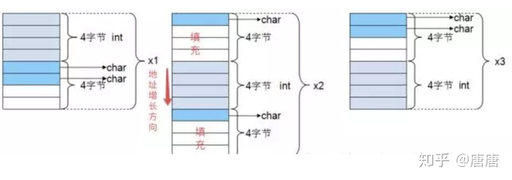

# C 程序内存对齐
## 什么是内存对齐
&nbsp;&nbsp;元素是按照定义顺序一个一个放到内存中去的，但并不是紧密排列的。从结构体存储的首地址开始，每个元素放置到内存中时，它都会认为内存是按照自己的大小（通常它为4或8）来划分的，因此元素放置的位置一定会在自己宽度的整数倍上开始，这就是所谓的内存对齐。

## 内存对齐的原因
### 1. 平台原因(移植原因)
&nbsp;&nbsp;不是所有的硬件平台都能访问任意地址上的任意数据的；某些硬件平台只能在某些地址处取某些特定类型的数据，否则抛出硬件异常。

### 2. 性能原因
&nbsp;&nbsp;数据结构(尤其是栈)应该尽可能地在自然边界上对齐。原因在于，为了访问未对齐的内存，处理器需要作两次内存访问；而对齐的内存访问仅需要一次访问。
   + 假如没有内存对齐机制，数据可以任意存放，现在一个int变量存放在从地址1开始的联系四个字节地址中，该处理器去取数据时，要先从0地址开始读取第一个4字节块,剔除不想要的字节（0地址）,然后从地址4开始读取下一个4字节块,同样剔除不要的数据（5，6，7地址）,最后留下的两块数据合并放入寄存器。这需要做很多工作。
   + 现在有了内存对齐的，int类型数据只能存放在按照对齐规则的内存中，比如说0地址开始的内存。那么现在该处理器在取数据时一次性就能将数据读出来了，而且不需要做额外的操作，提高了效率。

## 内存对齐规则
### 1. 基本类型
&nbsp;&nbsp;基本类型的对齐值就是sizeof值

### 2. 数据成员对齐规则
&nbsp;&nbsp;数据成员对齐规则：结构(struct)(或联合(union))的数据成员，第一个数据成员放在offset为0的地方，以后每个数据成员的对齐按照#pragma pack指定的数值和这个数据成员自身长度中，比较小的那个进行;
  + 即：  将 "#pragma pack指定的数值" 和 “数据成员自身长度” 进行比较，取最小的那个.这就是成员对齐模数
  + 成员首地址的偏移量应该是成员对齐模数的整数倍

### 3. 结构(或联合)的整体对齐规则
&nbsp;&nbsp;结构(或联合)的整体对齐规则：在数据成员完成各自对齐之后，结构(或联合)本身也要进行对齐，对齐将按照#pragma pack指定的数值和结构(或联合)最大数据成员长度中，比较小的那个进行;
  + 即：  将 "#pragma pack指定的数值" 和 “最大数据成员长度” 进行比较，取最小的那个.这就是整体的对齐模数
  + 则结构体的整体大小应该是整体对齐模数的整数倍
### 4. 起始内存地址
&nbsp;&nbsp;如果某个机器的整型值长度为4个字节，那么它的起始存储位置必须能够被4整除。

### 示例
```c
    #include <stdio.h>
    struct {
      int i;
      char c1;
      char c2;
    } Test1;

    struct {  // 变量声明不合理，造成了内存的浪费
      char c1;
      int i;
      char c2;
    } Test2;

    struct {
      char c1;
      char c2;
      int i;
    } Test3;

    int main() {
      printf("%ld\n", sizeof(Test1)); // 输出8
      printf("%ld\n", sizeof(Test2)); // 输出12
      printf("%ld\n", sizeof(Test3)); // 输出8
      return 0;
    }
```
+ 默认#pragma pack(4)，且结构体中最长的数据类型为4个字节，所以有效对齐单位为4字节，下面根据上面所说的规则以第二个结构体来分析其内存布局： 
  1. 首先使用规则1，对成员变量进行对齐：
     - sizeof(c1)=1<=4(有效对齐位)，按照1字节对齐，占用第0单元。
     - sizeof(i) = 4<=4(有效对齐位)，相对于结构体首地址的偏移量要为4的倍数，占用第4，5，6，7单元 
     - sizeof(c2)=1 <=4(有效对齐单位)，相对于结构体单位要为1的倍数，占用第8单元。
  2. 使用规则2，对结构体整体进行对齐 
     - 第二个结构体中变量i占用内存最大占4字节，而有效对齐单位也为4字节，两者较小就是4字节。因此整体也是按照4字节对齐。由规则1得到s2(第二个结构体)占9个字节，此处再按照规则2进行整体的4字节对齐，所以，整个结构体占用12字节。
+ 根据上面的分析，可以得出上面例子中三个结构体的内存布局如下: 
    - 
---
## 附录
### 1. #pragma pack(n)
&nbsp;&nbsp;使用伪指令#pragma pack(n)，C编译器将按照n个字节对齐
## 2. __attribute((aligned (n)))
&nbsp;&nbsp;__attribute((aligned (n)))，让所作用的结构成员对齐在n字节自然边界上。如果结构中有成员的长度大于n，则按照最大成员的长度来对齐。
## 3. attribute((packed))
&nbsp;&nbsp;attribute((packed))，取消结构在编译过程中的优化对齐，按照实际占用字节数进行对齐。

---
## 参考资料
1.  《C和指针》 P205
2.  https://zhuanlan.zhihu.com/p/140063999
3.  [豆大侠](https://doudaxia.club/index.php/archives/166/)