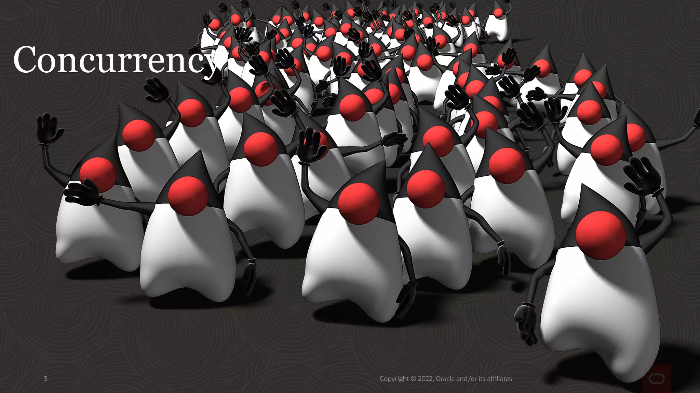
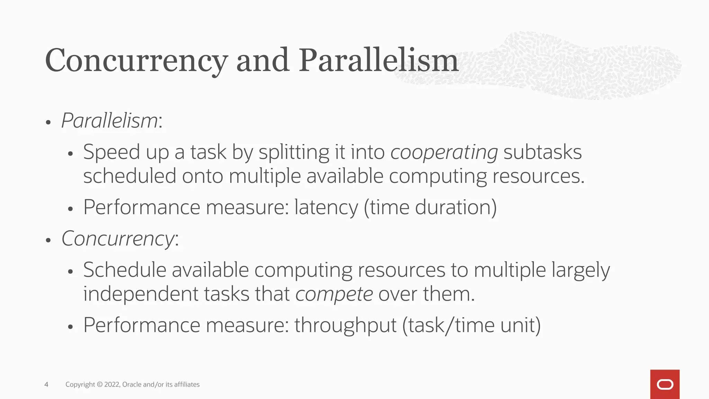
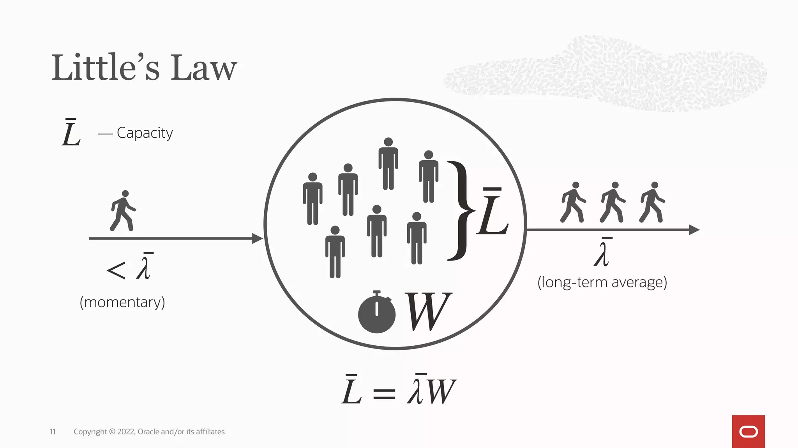
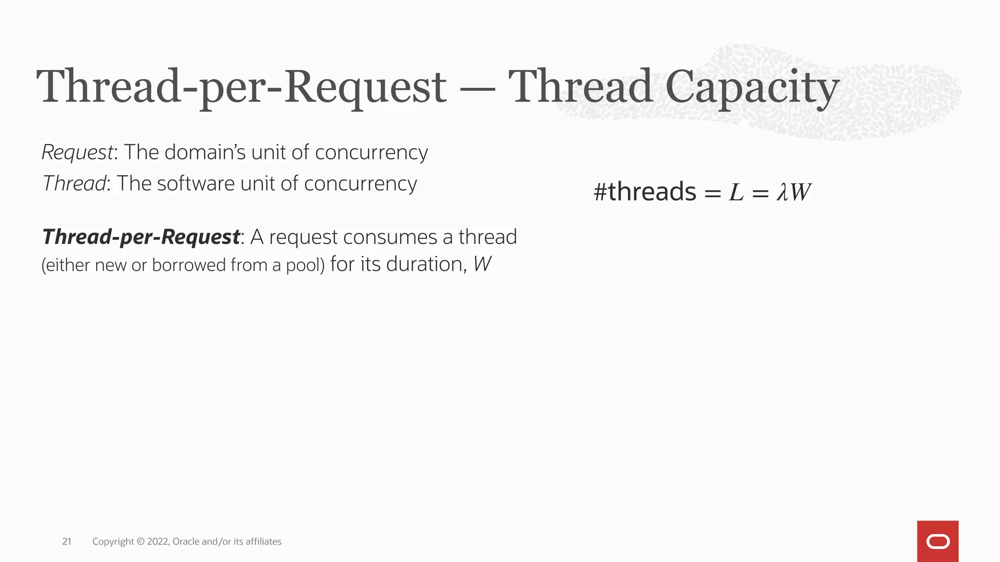

# 002.Why User-Mode Threads Are Good For Performance
+ 
+ 
+ 
+ 
+ 
+ 
+ 
+ 
  
  ```txt
      Little's Law （利特尔法则）
      In any stable system with long term averages（在任何具有长期平均值的稳定系统中）:
          λ —— arrival rate = exit rate = throughput
          W —— duration inside 
          L —— no. items inside
  ```

+ 
+ 
+ 
+ 
+ 
+ 
+ 
+ 
+ 
+ 
+ 
+ 
+ 
+ 
+ 
+ 
+ 
+ 
+ 
+ 
+ 

   ```txt
       Not cooperative , but no time-sharing yet 
       - Non-cooperative scheduling is more composable.(非合作调度更具可组合性。)
       - ...but people overestimate the importance of time-sharing in servers.(但是人们高估了服务器中分时的重要性。)
       - structured concurrency allows waiting for a set of operations with on context-switch.(结构化并发允许在上下文切换时等待一组操作)
   ``` 

+ 
  
   ```txt
       Summary（总结）:
       - Virtual threads allow higher throughput for the thread-per-request style —— the style harmonious with the platform —— by drastically increasing the request capacity of the server.(虚拟线程通过大幅增加服务器的请求容量，为thread-per-request风格（与平台和谐的风格）提供更高的吞吐量。)
       - we can juggle more balls not by adding hands but by enlarging the arch.(我们可以玩更多的球，不是通过增加手，而是通过扩大拱门。)
       - Context-switching cost could be important , but are not the main reason for the throughput increase.（上下文切换的开销可能很重要，但不是吞吐量增加的主要原因。）

       therad-per-request: 如上: A request consumes a thread(either new or borrowed from a pool) for it's duration.(请求在其持续时间内消耗一个线程（无论是新的还是从池中借用的）)
   ```

+ 


## 参考资料
1. [why-user-mode-threads-are-good-for-performance](https://www.p99conf.io/session/why-user-mode-threads-are-good-for-performance)