# 002.Why-User-Mode-Threads-Are-Good-For-Performance

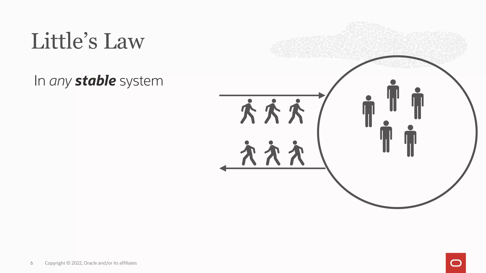

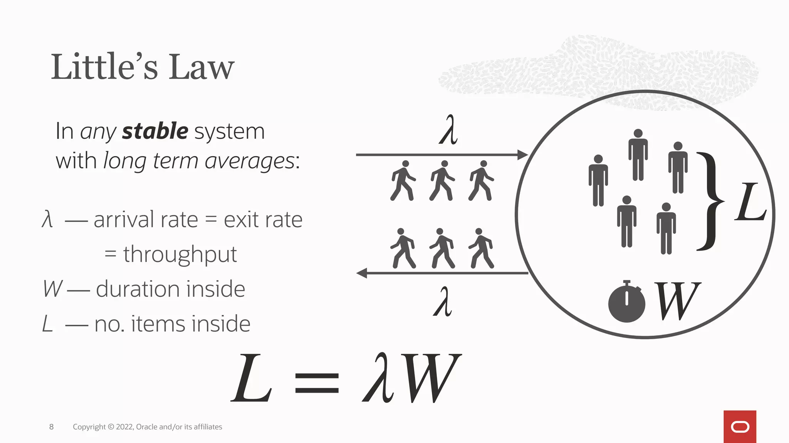
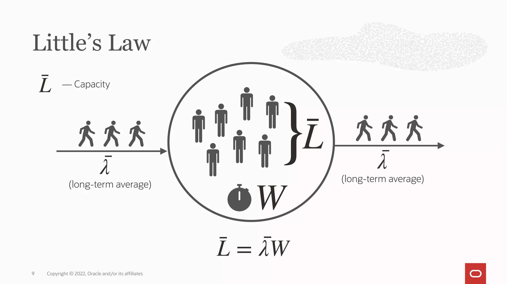
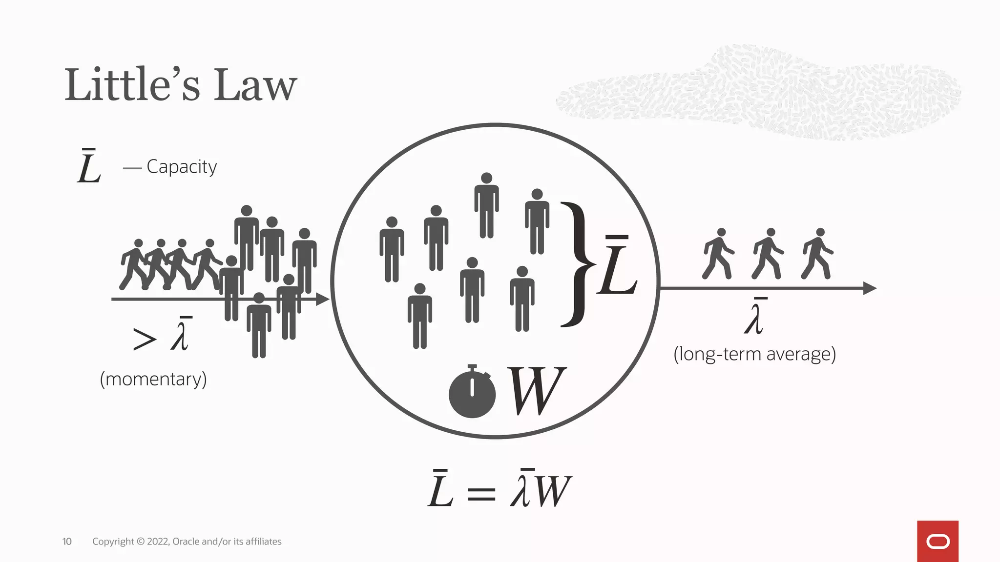

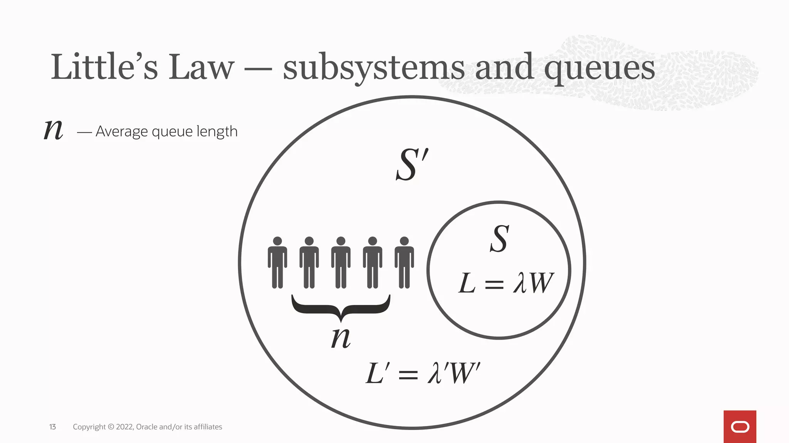

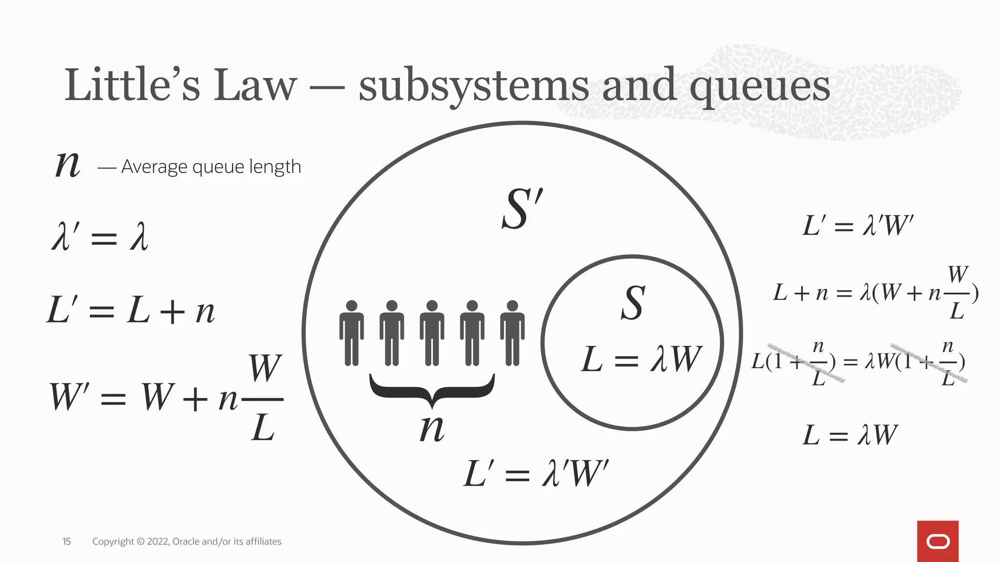
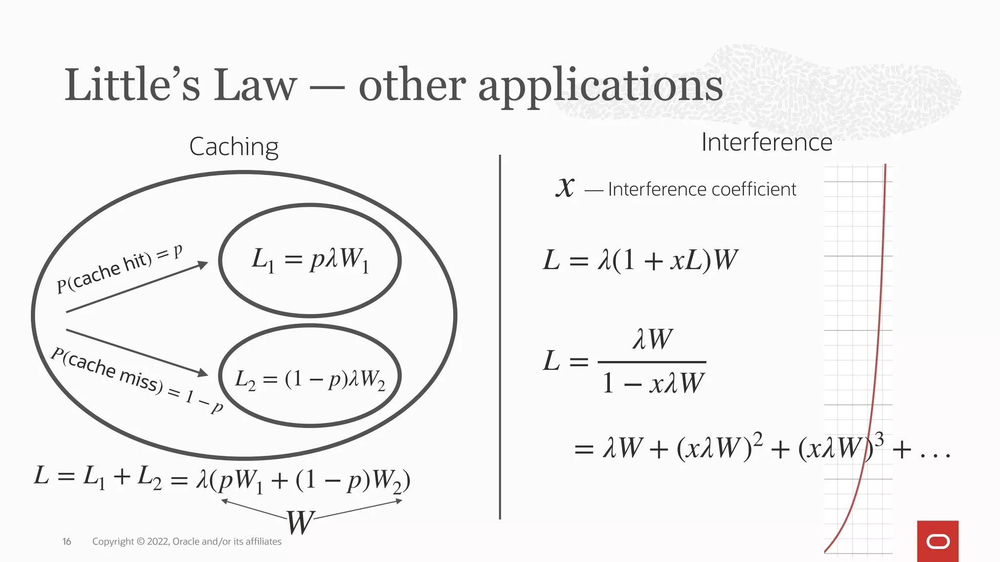

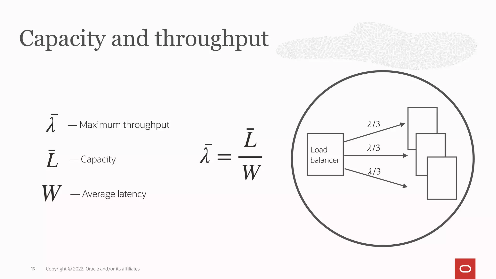
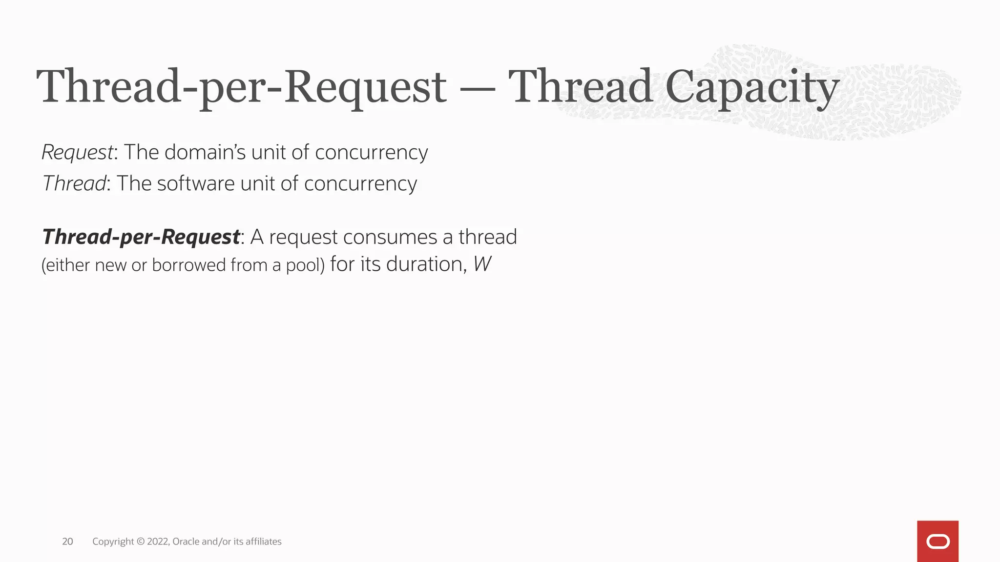

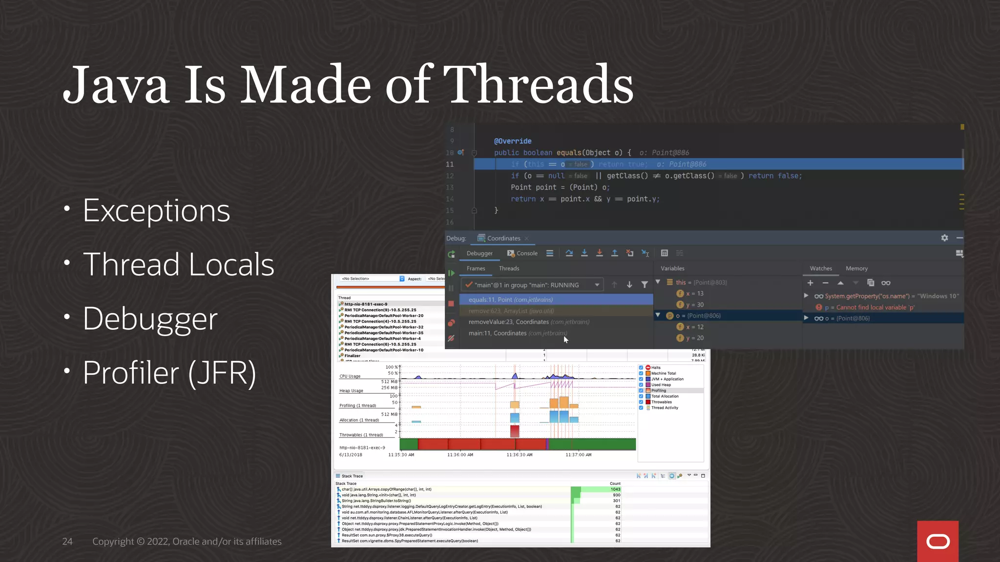
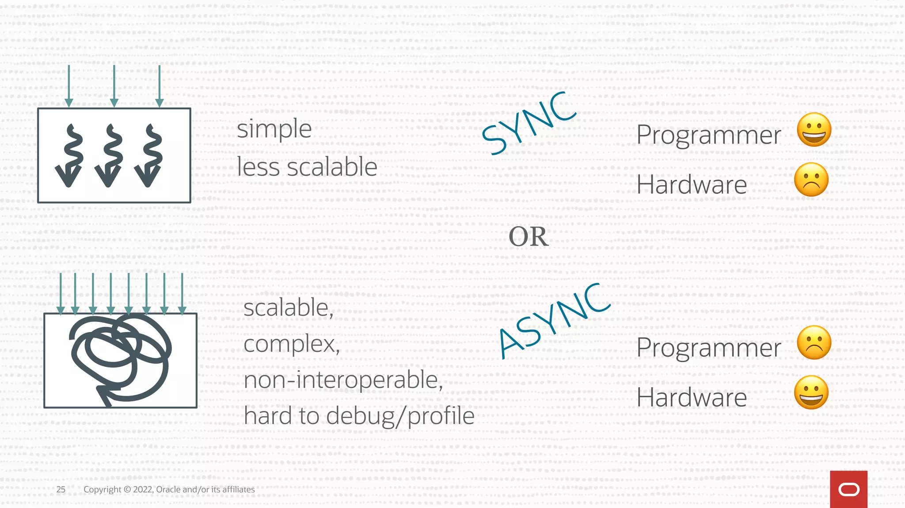

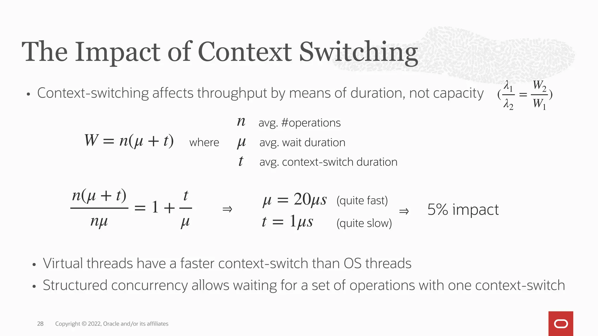

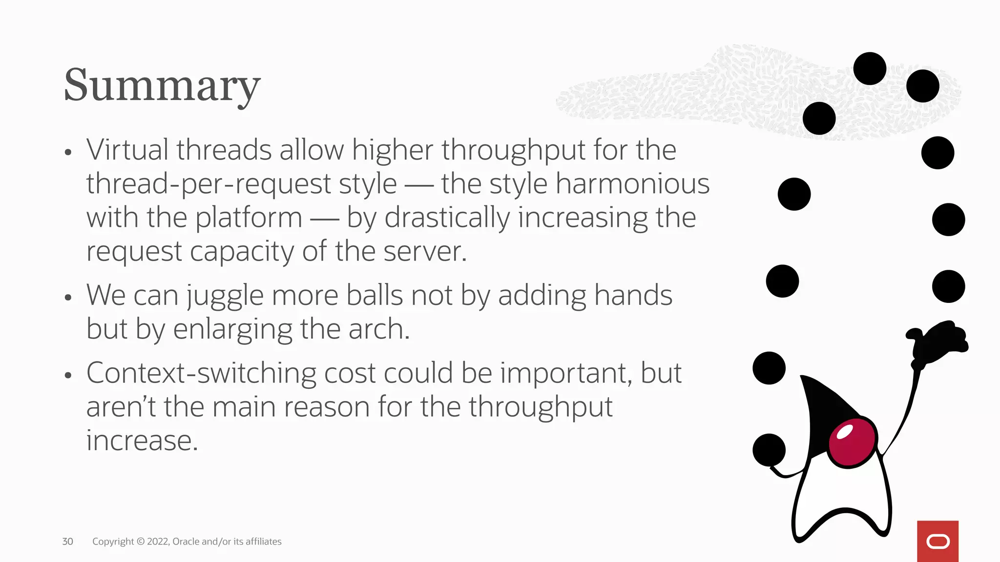

## 参考资料
1. [why-user-mode-threads-are-good-for-performance](https://www.p99conf.io/session/why-user-mode-threads-are-good-for-performance)