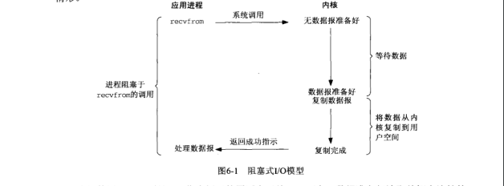
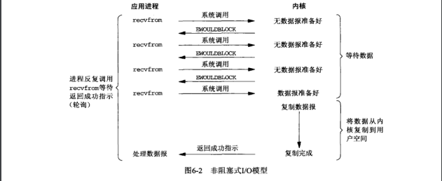
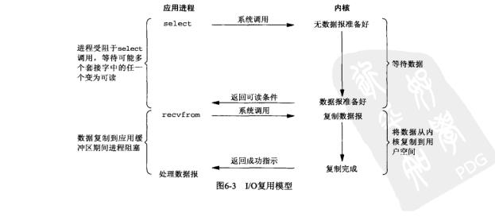
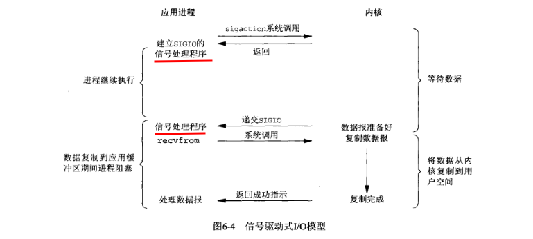
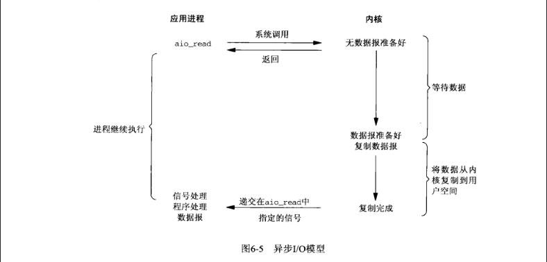
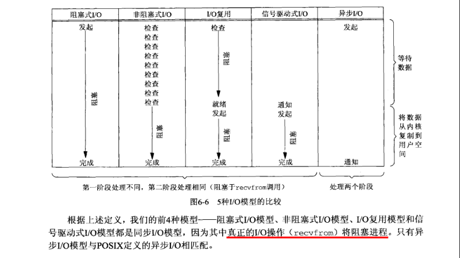

# I/O 模型
&nbsp;&nbsp;UNIX下可用的5种I/O模型
1. 阻塞I/O
2. 非阻塞I/O
3. I/O复用(select 和 poll)
4. 信号驱动式I/O（SIGIO）
5. 异步I/O

```txt
   在一个套接字上的输入操作通常包含两个不同的阶段：
      1. 等待数据准备好
      2. 从内核向进程复制数据(内核空间 -> 用户空间)
```

## 阻塞式I/O模型


&nbsp;&nbsp;如上图，进程调用recvfrom,其系统调用直到数据报到达且被复制到应用进程的缓冲区或者发生错误时才返回。最常见的错误时系统调用被信号中断.
- 进程在从调用recvfrom开始到他返回的整段时间内是被阻塞的，recvfrom返回之后，应用进程开始处理数据报.

## 非阻塞式I/O模型
&nbsp;&nbsp;进程把一个套接字设置成非阻塞是在通知内核：当所请求的I/O操作非得把本进程置于休眠状态才能完成时，不要把本进程置于休眠状态，而是返回一个错误。



&nbsp;&nbsp;前三次调用recvfrom时没有数据可以返回(轮询)，因此内核转而立即返回一个EWOULDBLOCK错误。第四次调用recvfrom时已有了一个数据报准备好，他被复制到引用进程缓冲区，于是recvfrom成功返回，应用程序继续处理数据。

&nbsp;&nbsp;应用进程轮询内核会耗费大量的CPU时间: 当一个应用进程对一个非阻塞描述符循环调用recvfrom时，即轮询。

## I/O复用模型
&nbsp;&nbsp;使用I/O复用，就可以调用select 或 poll 或 epoll,阻塞在这几个系统调用的某一个之上，而不是阻塞在真正的I/O系统调用上。



&nbsp;&nbsp;应用程序阻塞于select调用,等待数据报套接字变为可读。当select返回套接字可读这一条件时，调用recvfrom将所读数据报复制到应用程序缓冲区。

&nbsp;&nbsp;如上图，I/O复用并不显得有什么优势，事实上由于使用select需要两个而不是单个系统调用，I/O复用稍有劣势。但使用select的优势在于可以等待多个描述符就绪(Reactor线程模型)

## 信号驱动式I/O模型
&nbsp;&nbsp;通过使用信号，让内核在描述符就绪的时发送SIGIO信号通知应用进程。这种模型为信号驱动式I/O。



&nbsp;&nbsp;首先需要开启套接字的信号驱动式I/O功能，并通过sigaction系统调用安装一个**信号处理函数**。当数据准备好读取时，内核就会为该进程产生一个SIGIO信号，随后即可以在信号处理函数中调用recvfrom读取数据报，并通知主循环数据已准备好待处理.

## 异步I/O模型
&nbsp;&nbsp;异步I/O函数的工作机制： 告诉内核启动某个操作，并让内核在整个操作(包括将数据从内核复制到应用程序缓冲区)完成后通知应用程序。与前几种I/O模型相比： **前几种都是通知应用进程何时启动一个I/O操作，而异步I/O模型由内核通过I/O何时完成。**




-----

## 各种I/O模型的比较


+ 如上图，真正阻塞进程的是 recvfrom
