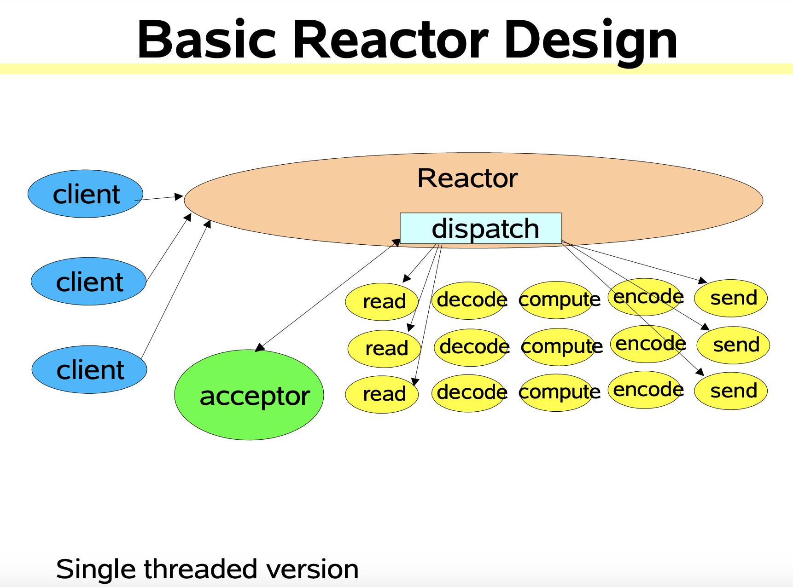
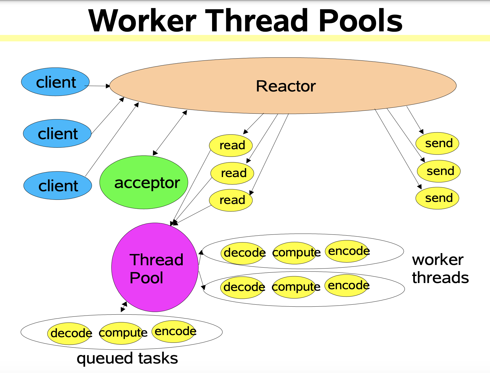
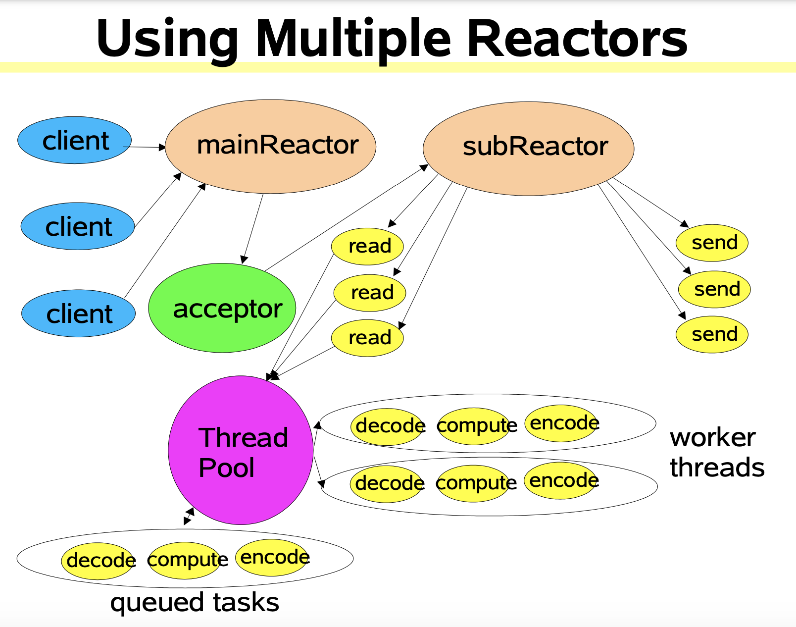

# Reactor 线程模型
&nbsp;&nbsp;Reactor模型是网络服务器端用来处理高并发网络I/O请求的一种编程模型。

&nbsp;&nbsp;三类处理事件: 连接事件 、 写事件 、 读事件

&nbsp;&nbsp;三个关键角色: reactor 、 acceptor 、 handler

&nbsp;&nbsp;Reactor模型处理的是客户端和服务器端交互的过程，而这三类事件正好对应了客户端和服务器端交互过程中，不同类请求在服务器端引发的待处理事件(**从服务器角度**):
- 连接事件: 当一个客户端要和服务端进行交互时，客户端会向服务端发送连接请求，以建立连接.
- 写事件: 一旦连接建立之后，客户端会给服务端发送读请求，以便读取数据。服务端在处理读请求时，需要向客户端写回数据。
- 读事件: 无论客户端给服务器端发送读或写请求，服务器都需要从客户端读取请求内容。

&nbsp;&nbsp;这三类事件是由谁处理呢？
1. 连接事件由acceptor来处理，负责接收连接；accecptor在接收连接之后，会创建handler,用于网络连接后的后续读写事件的处理；
2. 读写事件由handler处理
3. 在高并发场景中，连接事件、读写事件会同时发生，所以，需要有一个角色专门监听和分配事件，这就是reactor角色.

## Reactor 三种模式
### 1. 单Reactor单线程
- 

   1. Ractor对象通过select监控客户端请求，收到事件后通过Dispatch进行分发
   2. 如果是建立连接请求事件，则由Acceptor通过accept处理连接请求，然后创建Handler对象处理连接完成后的后续业务处理。
   3. 如果不是建立连接请求事件，则Reactor则会分发调用连接对应的Handler来响应.
   4. Handler会完成Read -> 业务处理 -> Send 完整业务逻辑。

&nbsp;&nbsp;模型简单，没有多线程、竞争问题。单无法发挥多核CPU功能。

---

### 2. 单Reactor多线程
- 
  
   1. Reactor对象通过select监控客户端请求，当请求事件到达后，通过Dispatch分发请求
   2. 若是建立连接的请求，则通过Acceptor处理连接请求，然后创建Handler事件来处理后续逻辑
   3. 如果不是建立连接事件，则通过Reactor分发到连接对应的Handler来处理
   4. Handler只负责响应事件，不做具体的业务处理，通过read读取数据后，分发给worker工作线程池去处理业务。
   5. worker线程池会分配独立的线程去完成真正的业务，并将结果返回给handler
   6. handler收到响应后，通过send方法将结果返回给client

&nbsp;&nbsp;可以充分利用多核CPU的能力。但Reactor依旧是单线程去处理所有的事件监听与响应，在高并发下依旧存在性能问题。

---
### 3. 主从Reactor多线程
- 

   1. Reactor 主线程MainReactor对象通过select监听连接事件，收到事件后，通过Acceptor处理事件。
   2. Acceptor处理连接事件后，**MainReactor将连接分配给SubReactor**
   3. SubReactor将连接加入到连接队列中进行监听，并创建Handler进行各种事件处理。
   4. 当有新事件发生，SubReactor将调用对应的Handler处理
   5. Handler通过read读取数据，分发给后面的worker线程处理。
   6. Handler收到响应结果后，通过send发送给client

> MainReactor 可以对应多个SubReactor !!!

&nbsp;&nbsp;响应快，不必为单个同步事件所阻塞，虽然Reactor本身依然是同步的；可以最大程度避免复杂的多线程及同步问题，并且避免多线程/进程的切换；扩展性好，可以方便通过增加Reactor实例个数充分利用CPU资源；