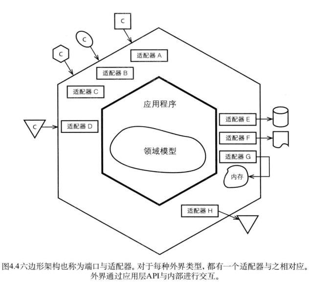

# 架构
## 分层
&nbsp;&nbsp; 在分层架构中，我们将领域模型和业务逻辑分离出来，并减少对基础设施、用户界面甚至应用层逻辑的依赖，因为他们不属于业务。将一个复杂的系统分为不同的层，每层都应该具有良好的内聚性，并且只依赖于比自身更低的层。
- 

&nbsp;&nbsp;在这个传统的分层架构中，存在着一些与领域相关的挑战: 在分层架构中，领域层或多或少地需要使用基础设施层：
+ 资源库接口的实现需要基础设施层提供的持久化机制。那么，如果将资源库接口直接实现在基础设施层会怎样呢？由于基础设施层位于领域层之下，从基础设施层向上引用领域层则违反了分层架构的原则。遵从分层架构原则并不意味着领域对象需要需要与基础设施层发生直接耦合，此时可以采取模块的方式来隐藏技术实现细节。

## 依赖倒置原则
&nbsp;&nbsp;高层模块不应该依赖于低层模块，两者都应该依赖于抽象;抽象不应该依赖于细节，细节应该依赖于抽象 —— 依赖倒置原则.

&nbsp;&nbsp;根据该定义，低层服务(如基础设施层)应该依赖于高层组件(如用户界面层、应用层、领域层)所提供的接口。在架构中采用依赖倒置原则有很多种表达方式，如: 
- 
  
  - 对于这种架构，我们可以在领域层中定义资源库接口，然后在基础设施层实现该接口。

&nbsp;&nbsp;开发时，应当将关注点放在领域层上，采用依赖倒置原则，使领域层和基础设施层都只依赖于由领域模型所定义的抽象接口。
> 当在分层架构中采用依赖倒置原则时，事实上已经不存在分层的概念了，无论是高层还是低层，他们都只依赖于抽象，好像是把架构推平了一样。如果将分层架构推平，再向其中加入一些对称性会变得如何?

##  六边形架构（端口与适配器）
&nbsp;&nbsp;在六边形架构中，不同的客户通过“平等”的方式与系统交互。需要新的客户时，只需要添加一个新的适配器将客户输入转化成能被系统API所理解的参数就行了。同时，系统输出，比如图形界面、持久化和消息等都可以通过不同方式实现，并且可以是互换的。这是可能的，因为对于每种特定的输出，都有一个新建的适配器负责完成相应的转化功能。
- 

&nbsp;&nbsp;每种类型的客户都有他自己的适配器，该适配器用于将客户输入转化为程序内部API所理解的输入。六边形每条不同的边代表了不同种类型的端口，端口要么处理输入，要么处理输出。

&nbsp;&nbsp;如上图，有3个客户请求均抵达了相同的输入端口（适配器A、B、C），另外一个客户请求使用了适配器D。可能前三个请求使用了HTTP协议，而后一个请求则使用了AMQP协议(如RabbitMQ)。端口并没有明确定义，他是一个非常灵活的概念。无论采用哪种方式对端口进行划分，当客户请求到达时，都应该有相应的配置器对输入进行转换，然后端口将调用应用程序的某个操作或者向应用程序发送一个事件，控制权由此交给内部区域。
> 按照功能需求来设计内部区域中的应用程序:
> > 在使用六边形架构的时候，应当根据用例来设计应用程序，而不是根据需要支持的客户数目来设计。任何客户都可能向不同的端口发出请求，但是所有的适配器都将使用相同的API。

&nbsp;&nbsp;如上图右侧的适配器与端口，可以讲资源库的实现看作是持久化适配器，该适配器用于访问先前存储的聚合实例，或者保存新的聚合实例。如E、F、G适配器所展示的，可以通过不同的方式实现资源库： 关系型数据库、基于文档的存储、分布式缓存及内存存储。

## 面向服务架构
