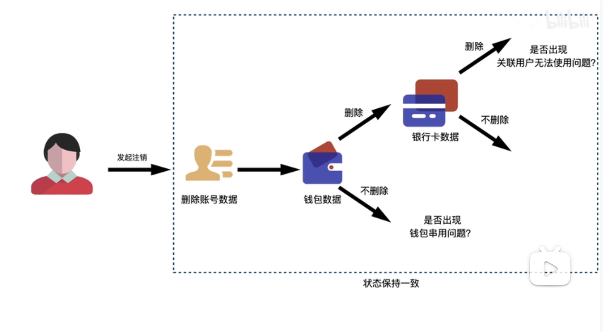
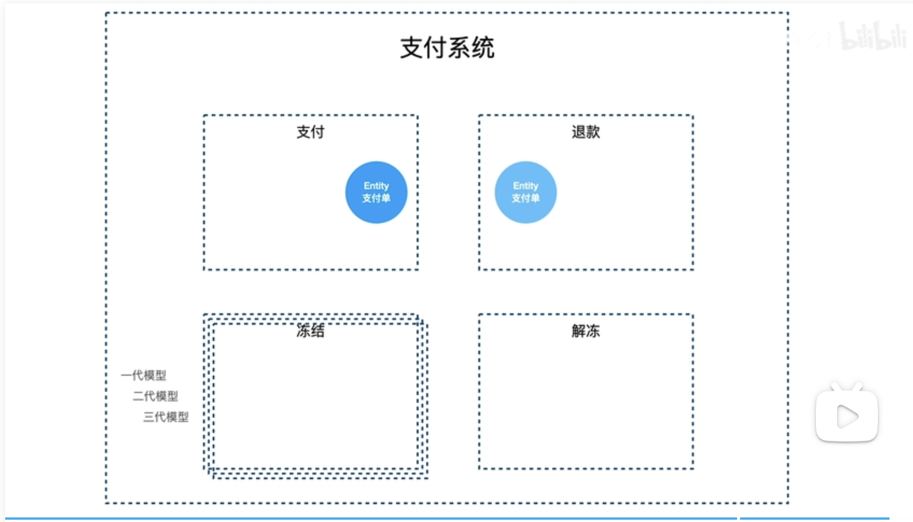

# 领域驱动设计·概念-聚合（Aggregate）
## 简要
&nbsp;&nbsp;聚合，是对存在引用关系的一组对象的封装，他的目的就是屏蔽内部对象之间复杂的关联关系，只对外暴露统一的接口，

&nbsp;&nbsp;在一个复杂的软件中，一个业务动作可能会涉及大量存在关联的对象，聚合的价值就是通过封装来保证所有关联对象的状态一致，

## 属性
### 1. 根对象(Root)
&nbsp;&nbsp;聚合外部可以根据跟对象来操作聚合，而聚合内部则执行一系列的逻辑来保持各个对象状态的一致。

### 2. 边界(BC.Bounded Context.限界上下文)
&nbsp;&nbsp;为了解决复杂系统的领域分治问题，不限于DDD。

---

## 说明
### 聚合（Aggregate）

- 为什么要聚合(Aggregate)：当用户A用手机号(假定为微信号的唯一标识)PhoneNum1注册了微信账号，那么他现在不用这个手机号了，选择注销掉，那么他的微信钱包数据是否需要同步删除呢？若不删除，用户B使用该手机号注册微信时，会发现微信居然绑定了其他人的微信钱包。如果要删除微信钱包，那么微信钱包所绑定的银行卡是否也需要同步删除呢?

## 边界 (BC)
&nbsp;&nbsp;为了解决复杂系统的领域分治问题，不限于DDD。

&nbsp;&nbsp;如支付系统，可能被分为四个领域，那么BC可以带来哪些优势呢?
1. 领域隔离。
   - 在四个领域中，都需要承载 支付单 语义的，在数据表中，可能都对应着同一条数据，但是从不同的领域中看待支付单的角度不同，业务逻辑的侧重点不一样，所以建模的方式也会存在差异。
   - 这些差异是否需要区分，从DDD的角度去看，他们应该使用不同的实现： 通过BC进行隔离，假设以后的系统变得越来越复杂，两种支付单对象的差异也越来越大，在一个BC中改动就会很安全。
2. 模型隔离
   - 当一个系统变得很庞大，或者经历了长时间的迭代，他的内部可能催生出多套模型多套架构，他们可能处于共同运行的状态，甚至可能共用一部分代码，但目标从老模型彻底切换到新模型。以冻结领域为例，目前存在三套模型，这三套模型应该使用BC尽可能隔离起来，模型之间交叉的地方使用适配器进行适配。这样开发人员无法对多套模型的运作都了解的情况下，在一套模型下修改是相对安全的。
   - BC是一套思想，包含多种设计模式