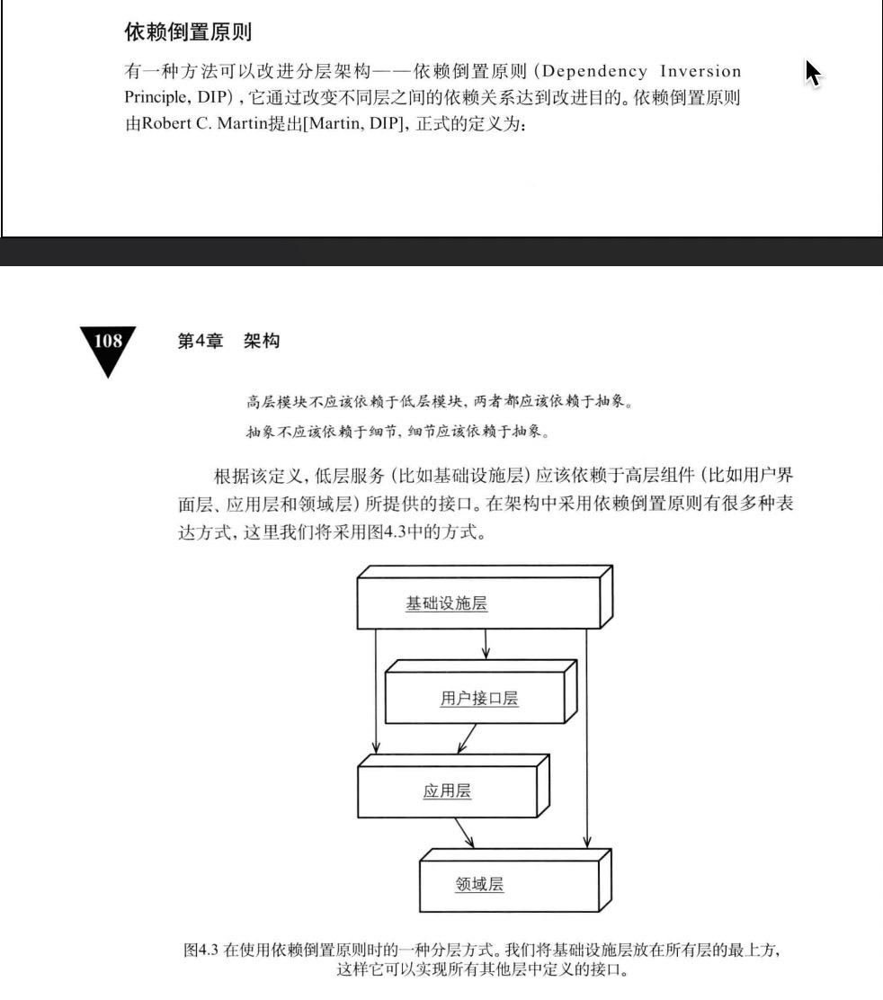

# 资源库
&nbsp;&nbsp; 资源库(Repository)是对数据访问的一种业务抽象，使其具有业务意义。利用资源库抽象，就可以解耦领域层和外部资源，使领域层变得更为纯粹，能够脱离外部资源而单独存在。
> 所以，资源库的接口是在领域层，但是他的实现是在基础设施层。
>> 这样做的好处之一就是让业务逻辑层只关注业务层的逻辑，而不需要关注具体的存储层技术的实现。
>>> 那么就需要使用依赖倒置原则，使得基础设施层依赖领域层。

## 分层架构
- 
> 将关注点放到领域层，采用依赖倒置原则，使领域层和基础设施层都只依赖于领域模型所定义的抽象接口。

## 参考资料
1. 《实现领域驱动设计》 P108