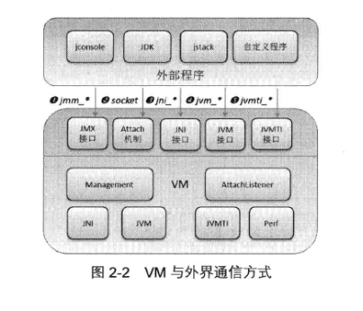

# VM与外界通信方式
&nbsp;&nbsp;VM与外界通信方式如下图:

- 

## JNI模块
&nbsp;&nbsp;Java本地接口(Java Native Interface,JNI)是Java标准的重要组成部分。他允许Java代码和本地代码进行交互，如与C/C++代码实现相互调用。虽然Java在平台移植性方面具有天然的优势，但是有的时候Java程序需要使用一些与底层操作系统或硬件相关的功能，这时候就需要一种机制，**允许调用本地库或者JVM库**。在JDK中定义了很多函数都依赖这些由本地语言实现的库。JNI模块提供Java运行时接口，定义了许多以"jni_"为前缀命名的函数，允许JDK或者外部程序调用由C/C++实现的库函数。

&nbsp;&nbsp;JNI导出函数:
- openJDK_8u40/hotspot/src/share/vm/prims/jni.h

## JVM模块
&nbsp;&nbsp;在JVM模块中，虚拟机向外提供了一些函数，以"JVM_"为前缀命名，**作为标准JNI接口的补充**。主要分为三部分:
1. JVM相关的函数，用来支持一些需要访问本地库的Java API
2. 一些函数和常量定义，用来支持字节码验证和Class文件格式校验
3. 各种I/O和网络操作，用来支持Java I/O和网络API

&nbsp;&nbsp;JVM导出函数:
- openJDK_8u40/hotspot/src/share/vm/prims/jvm.h