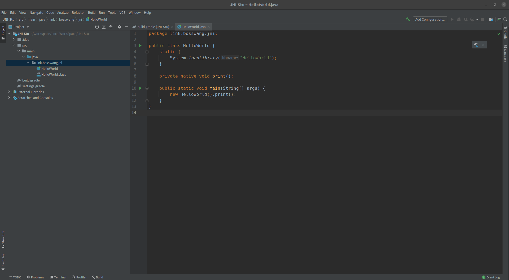
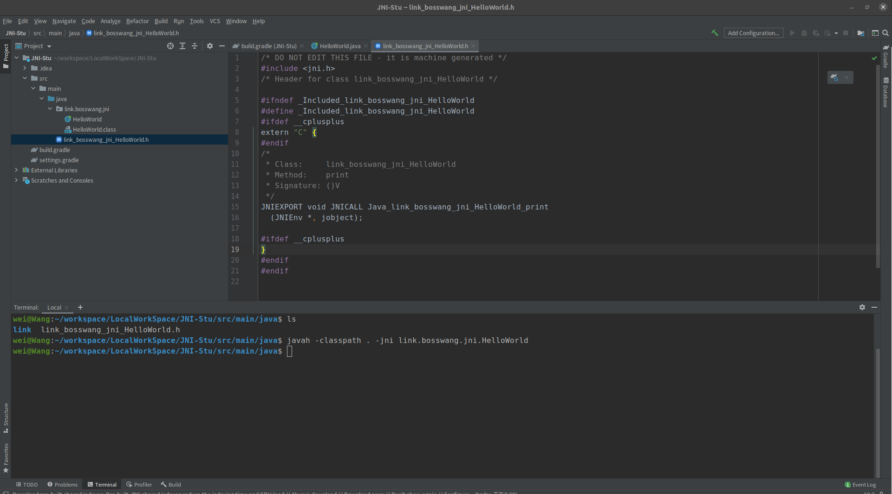
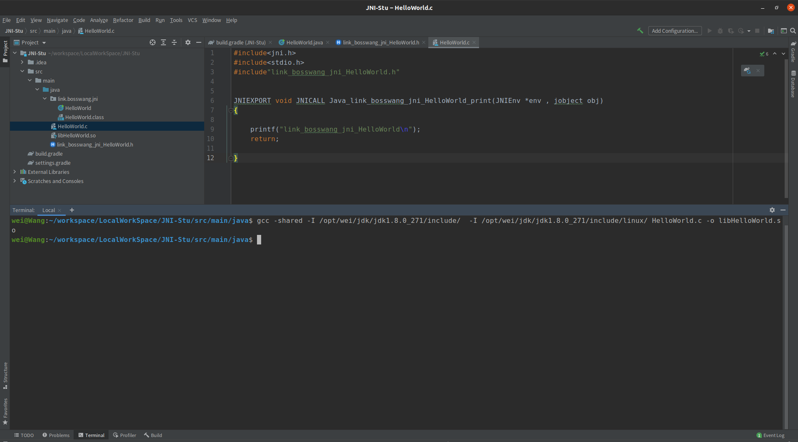
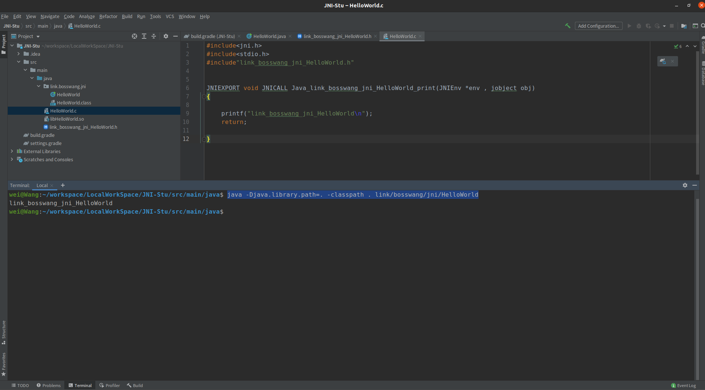

# JNI(Java Native Interface)
&nbsp;&nbsp;JNI是Java Native Interface的缩写，通过使用 Java本地接口书写程序，可以确保代码在不同的平台上方便移植

&nbsp;&nbsp;  JNI是JAVA标准平台中的一个重要功能，它弥补了JAVA的与平台无关这一重大优点的不足，在JAVA实现跨平台的同时，也能与其它语言（如C、C++）的动态库进行交互，给其它语言发挥优势的机会。


## 实现一个简单的JNI
### 01.新建一个java工程，编写如下代码

   ```java
        package link.bosswang.jni;

        public class HelloWorld {
            static {
                System.loadLibrary("HelloWorld");
            }

            private native void print();

            public static void main(String[] args) {
                new HelloWorld().print();
            }
        }
   ```

### 02. 将HelloWorld.java编译为Class文件
+ 命令: javac link/bosswang/jni/HelloWorld.java
+ 如图: 

### 03. 通过javah命令获取JNI头文件
+ 命令: javah -classpath . -jni link.bosswang.jni.HelloWorld
+ 如图: 
    - 执行上述命令之后，则会出现： link_bosswang_jni_HelloWorld.h 头文件。内容如下：
       ```c
           /* DO NOT EDIT THIS FILE - it is machine generated */
            #include <jni.h>
            /* Header for class link_bosswang_jni_HelloWorld */

            #ifndef _Included_link_bosswang_jni_HelloWorld
            #define _Included_link_bosswang_jni_HelloWorld
            #ifdef __cplusplus
            extern "C" {
            #endif
            /*
            * Class:     link_bosswang_jni_HelloWorld
            * Method:    print
            * Signature: ()V
            */
            JNIEXPORT void JNICALL Java_link_bosswang_jni_HelloWorld_print
            (JNIEnv *, jobject);

            #ifdef __cplusplus
            }
            #endif
            #endif
 
       ```       
### 04. 使用本地代码实现头文件中的方法,并编译为动态库
+ 代码： HelloWorld.c 
+ 命令:    gcc -shared -I /opt/wei/jdk/jdk1.8.0_271/include/  -I /opt/wei/jdk/jdk1.8.0_271/include/linux/ HelloWorld.c -o libHelloWorld.so
+ 如图:     
#### 代码注释
+ extern "C"。JNI函数声明声明代码是用C++语言写的，所以需要添加extern "C"声明；如果源代码是C语言声明，则不需要添加这个声明
+ JNIEXPORT。这个关键字表明这个函数是一个可导出函数。每一个C/C++库都有一个导出函数列表，只有在这个列表里面的函数才可以被外部直接调用，类似Java的public函数和private函数的区别。
+ JNICALL。说明这个函数是一个JNI函数，用来和普通的C/C++函数进行区别。
+ void 返回值类型
+ JNI函数名原型：Java_ + JNI方法所在的完整的类名，把类名里面的”.”替换成”_” + 真实的JNI方法名，这个方法名要和Java代码里面声明的JNI方法名一样。
+ JNIEnv* 参数 是一个执行JNIENV函数表的指针。
+ jobject 参数值代表的是方法的接收者。
    - 若是成员方法，此时参数的类型是jobject.(示例方法是成员方法，因此这里参数类型是jobject)
    - 若方法是静态方法，该字段的类型是jclass.
### 05. 执行代码
+ 命令： java -Djava.library.path=. -classpath . link/bosswang/jni/HelloWorld
+ 如图: 
   - 如图，指定代码输出了 “link_bosswang_jni_HelloWorld”