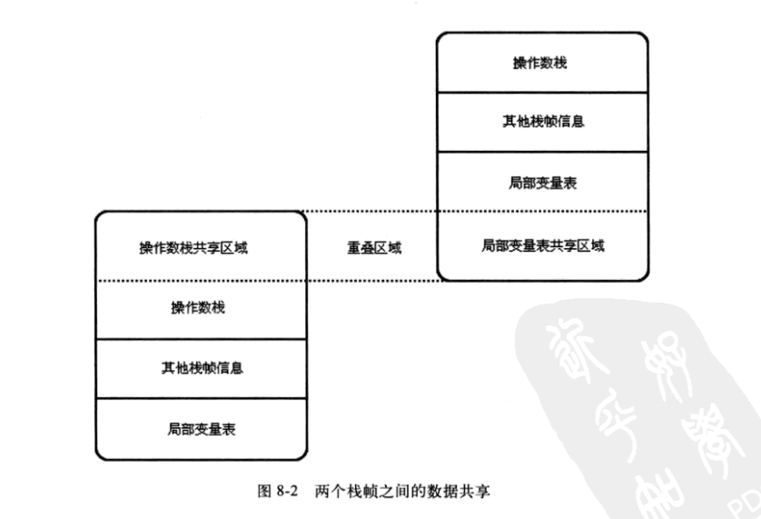
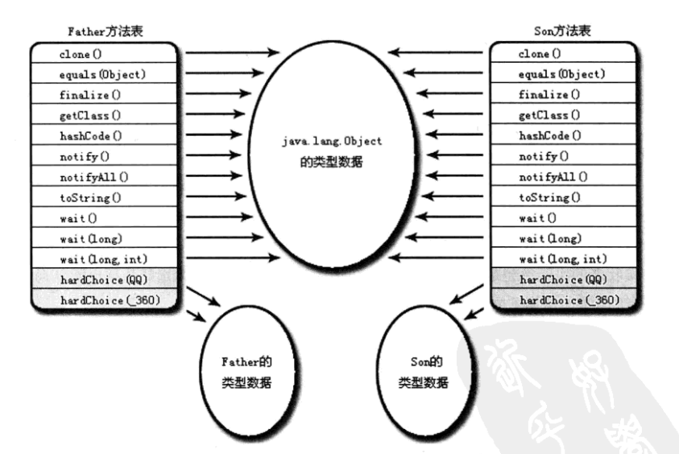

# 虚拟机字节码执行引擎
## 标准规范与自定义实现
1. 在Java虚拟机规范中制定了虚拟机字节码执行引擎的概念模型，这个概念模型成为各种虚拟机执行引擎的同一外观
2. Java虚拟机执行引擎输入的都是字节码文件，处理过程是字节码解析的等效过程，输出的是执行结果
   - 在不同的虚拟机中，执行引擎在执行java代码的时候可能会有解释执行和编译执行两种选择，也有可能两种都具备
## 运行时栈帧结构
### 虚拟机栈的元素 - 栈帧
栈帧(stack frame)是用于支持虚拟机进行**方法调用和方法执行**的数据结构，他是虚拟机运行时数据区中的虚拟机栈的栈元素
  + 栈帧与方法执行有什么联系？压栈？
#### 栈帧包含哪些内容
1. 局部变量表
2. 操作数栈
3. 动态连接
4. 返回地址
#### 什么是当前栈帧&当前方法
+ 背景：一个线程中的方法调用链可能很长，很多方法都同时处于执行状态。对于执行引擎来说，在活动线程中，只有位于栈顶的栈帧才是有效的，成为当前栈帧。与这个栈帧相关联的方法就是当前方法。**执行引擎所有的字节码指令都只针对于当前的栈帧进行操作**
   - 执行引擎所有的字节码指令都只针对于当前的栈帧进行操作
+ 虚拟机栈&栈帧的关系结构
<div></div>

### 局部变量表 
+ 作用：存放方法参数、方法内定义的局部变量
+ 基本单位:slot
   - JVM没有明确定义一个slot应该占用的内存空间的大小。只是说明每个slot都应该能够存放以下8种类型
      1. boolean
      2. byte
      3. char
      4. short
      5. int
      6. float
      7. reference
          表示对一个对象实例的引用，虚拟机并没有说明他的长度，也没有明确该是什么结构。但是通过这个引用该做到两点
            + 从引用中直接或者间接地查找到对象在堆中存放的起始地址索引（**找到实例**）
            + 从引用中直接或者间接地查找到对象所属数据类型在方法区中的存储的类型信息(**找到Class**)
      8. returnAddress
          指向一条字节码指令的地址
+ long和double的非原子协定
  将一次long/double类型的数据的读写分隔成两次32位读写
+ 访问方式
  - 虚拟机通过索引定位的方式使用局部变量表，索引值从0开始至局部变量表最大的slot数量。
     1. 若访问的是32位(一个slot表示)数据类型的变量，索引n就代表了使用第n个slot
     2. 若访问的是64位类型的变量，则说明会同时使用n和n+1两个slot。（jvm不允许使用任何方式单独访问其中的某一个slot）
+ **使用局部变量表完成参数值到参数变量列表的传递过程**
   - 若执行的是实例方法，那么局部变量表中第0位索引的slot默认是用于传递方法所属对象的实例的引用,在方法中可以使用关键字this来方法到这个隐含的参数。其余参数则按照参数列表顺序排序，占用从1开始的局部变量slot，参数表分配完成后，再根据方法体内部定义的变量顺序和作用域分配其余的slot
      + this（静态方法无此步骤）
      + 显示参数列表
      + 方法体内的局部变量
+ slot 是可以重用的
  - 基于这一点，在生成字节码文件的时候，方法的slot数量就已经确定了(见字节码文件方法表的code属性的max_locals的属性)
  - 为了尽可能节省栈空间，局部变量表中的slot是可以重用的。方法体中定义的变量，他的作用域并不一定会覆盖整个方法体。若当前字节码PC计数器的值已经超过了某个变量的作用域，那这个变量对应的slot就可以交由其他的变量使用
  - slot重用对垃圾收集的影响
      + 代码1
     ```java
     public class Demo{

      public static void main(String[] args){
         {
            byte[] placeHolder = new byte[64*1024*1024];
         }

         System.gc();
      }
     }
     //java -verbose:gc Demo
     //[GC (System.gc())  66805K->65960K(121856K), 0.0013052 secs]
    // [Full GC (System.gc())  65960K->65844K(121856K), 0.0043806 secs]
    // 可以看出，placeHodler并没有被回收
     ```
      + 代码2
      ```java
      public class Demo{

         public static void main(String[] args){
            {
               byte[] placeHolder = new byte[64*1024*1024];
            }

            int a = 0;

            System.gc();
         }
      }
      // java -verbose:gc Demo 
      //[GC (System.gc())  66805K->65896K(121856K), 0.0014384 secs]
      //[Full GC (System.gc())  65896K->308K(121856K), 0.0039774 secs]
      // 可以看出，placeHolder的内存被回收了
      ```
      + 为什么？
         - 第一次没有回收，是因为布局变量表中还存有关于placeHolder数据对象的引用(换句话说，能够通过GC Root找到placeHolder，这种关联没有打断)。虽然离开了placeHolder的作用域
         - 可以使用placeHolder = null;来代替int a = 0;(解释执行时有效)
   + 如何将垃圾回收与slot重用结合起来?
      - 又涉及到**“公有设计，私有实现”**
         + 共有设计：使用赋null值的操作来优化内存回收是建立在对字节码执行引擎概念模型的理解之上的。在虚拟机解释执行的时候，通常与概念模型比较接近。
         + 私有设计：通过JIT之后，是虚拟机执行代码的主要方式。赋null值在经过JIT编译优化之后被清除掉，所以此时赋null值没有任何意义。字节码被编译为本地代码之后，代码1的placeHolder在调用System.gc之后就会被回收掉。
      - 最好的方式是什么?
         + **以恰当的变量作用域来控制变量回收时间**。关键点：控制变量的作用域
   + 为什么Java变量一定要赋值才能使用[猜想]
      - 猜想:不想和C语言一样，不赋值就是给一个随机值，导致程序的错误。
           + 类变量，成员变量赋值，JVM帮忙做了
           + 局部变量赋值，只能手动做，为了性能
### 操作数栈
也称为操作栈，是一个后入先出的栈。
+ 栈的最大深度
   - 同局部变量表的slot数量一样，操作数栈的最大深度也在编译的时候写入到Code属性的max_stacks数据项中。在方法执行的任何时候，操作数栈的最大深度都不会超过max_stacks数据项中设定的值
+ 操作数栈的元素
   - 操作数栈的每一个元素可以是任意的java数据类型，包括long和double。32位数据类型所占的栈容量是1,64为数据类型所占的栈容量是2.
+ 操作数栈的使用
   - 当一个方法开始执行的时候，这个方法的操作数栈是空的，在方法执行的过程中，会有各种字节码指令往操作数栈写入和提取内容，这也就是出栈/入栈操作。
   - 例如：整数加法的字节码指令iadd在运行的时候操作数栈中最接近栈顶的两个元素已经存入了两个int类型的数值，当执行这个指令的时候，会将这两个int类型的值出栈[**java字节码指令操作的时候取的是栈顶的元素(有需要才会)，并且在执行的时候会将这个栈顶的元素出栈**]并且相加，然后再将相加的结果存入栈。(字节码指令操作的是栈顶元素)
+ 字节码指令和操作数栈
   - 操作数栈中的元素类型必须与字节码指令的序列严格匹配，在编译程序代码的时候，编译器要严格保证这一点，在类校验阶段的数据流分析中还需要验证这一点。
      + 以iadd指令为例，他在执行的时候，最接近栈顶的两个元素的数据类型必须是int，不能出现一个long和一个float使用iadd命令相加的情况
+ 操作数栈的优化
   - 即令两个栈帧出现一部分重叠，为的是在方法调用的时候就可以共用一部分数据，无须进行额外的参数复制传递
   - 栈帧共享如下图
     <div></div>
+ JVM的解释执行是基于栈的执行引擎
  - 这里所指的栈是 操作数栈。如上所举的iadd指令(参数是最接近操作数栈顶的元素（出栈），结果又放入栈顶（入栈），以便于给其他字节码指令使用)
### 动态连接
+ 每个栈帧都包含一个执行运行时常量池中该栈帧所属方法的引用，持有这个引用是为了支持方法调用过程中的动态连接
+ 字节码中的方法调用指令就是以常量池中指向方法的符号引用作为参数。而获取参数就涉及到动态连接和静态解析
   - 静态解析：这些符号引用会在类加载阶段或者第一次使用的时候就转化为直接引用。
      + 第一次使用和每一次使用有什么区别？
   - 动态连接：这部分符号引用会在每一次运行期间转化为直接引用
### 方法返回地址
#### 方法退出的两种方式
1. [正常完成出口]执行引擎遇到任意一个方法返回的字节码指令
   + 这时候可能会有返回值传递给上层的方法调用者，是否有返回值和返回值的类型将根据遇到何种方法返回指令来决定
2. [异常完成出口]在方法执行的过程中发生了异常，且这个异常没有在方法中处理。
   + 一个方法以异常完成出口的方式退出，是不会给它的上层调用者产生任何返回值
#### 方法退出完成的工作
1. 无论采用何种方式退出，在方法退出之后，都需要返回到方法被调用的地方，程序才能继续执行，方法返回时，可能需要在栈帧中保存一些信息，用来帮助恢复他的上层方法的执行状态。
   - 方法正常退出的时候，调用者的PC计数器的值可以作为返回地址，栈帧很可能会保存这个计数器的值。
   - 方法异常退出的时候，返回地址是要通过异常处理器表来确定的，栈帧中一般不会保存这部分信息
2. 方法退出的过程实际上就等同于将当前栈出栈，因此退出时的可能执行的操作有：恢复上层方法的局部变量表和操作数栈，把返回值压入调用者栈帧的操作数栈中，调整PC计数器的值以指向方法调用指令后面的一条指令等
### 方法调用
+ jvm在执行方法的一系列流程
#### 什么是方法的调用
+ 方法调用并不等同于方法的执行，方法调用阶段唯一的任务就是确定被调用方法的版本，暂时不涉及到方法内部的具体运行过程。
   - 一切方法在Class文件中存储的都只是符号引用，而不是方法在实际运行时内存布局的入口(即直接引用)
#### 解析调用
+ 解析调用一定是一个静态过程，在编译期间就完全确定。在类加载的解析阶段就会将符号引用全部转换为可确定的直接引用，不会延迟到运行期间完成
+ 所有方法调用中的目标方法在Class文件都是一个常量池中的符号引用。在类加载的解析阶段，会将其中的一部分符号引用转换为直接引用，这种解析能狗成立的前提：
   - [编译器期间可知，运行期间不可变]方法在程序真正执行前就有一个可以确定的调用版本，且这个方法的调用版本在运行期是不可变的。这类放那该法的调用称为解析
   - 满足**编译期可知，运行期不可变**的方法有两类:静态方法和私有方法。这两种方法各自的特点决定他们都不可能通过继承或别的格式来重写其他的版本，因此他们都适合在类加载阶段进行解析。
####  方法调用字节码指令
1. invokestatic: 调用静态方法
2. invokespecial: 调用实例构造方法\<init>,私有方法，父类方法
3. invokevirtual:调用所有**虚**方法
     + 运行时解析过程
        1. 找到操作数栈栈顶的第一个元素所指向的对象的实际类型，记作C
        2. 若在类型C中找到与常量中的**描述符**和**简单名称**都相符的方法，则进行权限校验。若通过校验则返回这个方法的直接引用，查找过程结束;若不通过，则返回java.lang.IllegalAccessError异常
           + 需要注意的是：是根据简单名称和描述符进行匹配的
        3. 否则，按照继承关系从下往上依次对C的各个父类进行第二步的搜索和验证的过程
        4. 若始终没有找到合适的方法，则抛出java.lang.AbstractMethodError异常
4. invokeinterface: 调用接口方法，**会在运行时再确定一个实现此类接口的对象**
5. invokedynamic:先在运行时动态解析出调用点限定符所引用的方法，然后在执行该方法。此前四条调用指令，分派逻辑固化在jvm内部，而invokedynamic指令的分派逻辑是由用户所设定的引导方法决定的。
    - 解析出调用点限定符所引用的方法是什么意思？
    - invokedynamic分派逻辑是什么?
#### 解析调用补充
1. 能被invokestatic以及invokespecial指令调用的方法，都可以在解析阶段中确定唯一的调用版本(静态方法、类\<init>方法、私有方法、父类方法)，他们在类加载的时候就会把符号引用解析为该方法的直接引用。这些方法称为非虚方法。
2. 被final修饰的方法(invokevirtual调用)，也可以在解析阶段确定唯一的调用版本，因为该类方法不可被重写。该类方法不是虚方法
#### 分派调用
+ 分派调用可能是静态的也可能是动态的
##### 静态分派
+ 所有依赖于静态类型来定位方法执行版本的分派动作成为静态分派。
+ [重要]jvm在**重载**时是通过参数的静态类型而不是实际类型作为判断依据的。如下代码：
   ```java
         public class StaticDispatch {
         public static abstract  class Human{}

         public static class Man extends Human{

         }

         public static class Woman extends Human{

         }


         public void sayHello(Human human){
            System.out.println("say Human");
         }

         public void sayHello(Man man){
            System.out.println("say Man");
         }

         public void sayHello(Woman woman){
            System.out.println("say Woman");
         }


         public static void main(String[] args){

            StaticDispatch staticDispatch = new StaticDispatch();
            /*
              这里的Human称为变量的静态类型，或者叫做外观类型。Man则称为变量的实际类型。
            */
            Human man = new Man();
            Human woman = new Woman();

            staticDispatch.sayHello(man);  // say Human
            staticDispatch.sayHello(woman); // say Human


         }
      }

   // 输出内容
      // say Human
      // say Human
   ```
+ 静态类型和实际类型在程序中都可以发生变化。区别在：
  - 静态类型的变化仅仅发生在使用时，变量本身的静态类型不会发生改变。且最终的静态类型实在编译期间可知的
  - 实际类型变化的结果在运行期才可以确定，编译器在编译程序的时候并不知道一个对象的实际类型是什么
  - 对静态类型&&动态类型 理解
     + 一个变量，拥有两个类型——静态类型&动态类型。变量的静态类型不会改变，在编译期间就已经确定下来了。但是动态类型只有在运行时期才能确定下来
  - 如下代码 
  ```java
     //实际类型变化
     Human  man = new Man();
     man = new Woman();

     //静态类型变化
     staticDispatch.sayHello((Man)man);
     staticDispatch.sayHello((Woman)man);
  ```

##### 动态分配
###### 代码分析
+ java源码
   ```java
   package link.bosswang.classloader;

   public class DynamicDispatch {

      static abstract class Human{

         protected  abstract  void sayHello();

      }


      static class Man extends  Human{

         @Override
         protected void sayHello() {
               System.out.println("Man say Hello");
         }
      }

      static class Woman extends  Human{

         @Override
         protected void sayHello() {
               System.out.println("Woman say Hello ");
         }
      }

      public static void main(String[] args){
         Human man = new Man();
         Human woman = new Woman();

         man.sayHello();
         woman.sayHello();

         man = new Woman();
         man.sayHello();
      }

      /**
      运行结果:
      Man say Hello
      Woman say Hello 
      Woman say Hello */
      
   }

   ```
+ 字节码
```java
Warning: Binary file DynamicDispatch contains link.bosswang.classloader.DynamicDispatch
Classfile /home/wei/WorkSpace/IntelliJ_IDEA/JVM/out/production/JVM/link/bosswang/classloader/DynamicDispatch.class
  Last modified Dec 7, 2019; size 843 bytes
  MD5 checksum 98e2bb7d92da1e89417cf0ec6bdddb08
  Compiled from "DynamicDispatch.java"
public class link.bosswang.classloader.DynamicDispatch
  minor version: 0
  major version: 52
  flags: ACC_PUBLIC, ACC_SUPER
Constant pool:
   #1 = Methodref          #8.#30         // java/lang/Object."<init>":()V
   #2 = Class              #31            // link/bosswang/classloader/DynamicDispatch$Man
   #3 = Methodref          #2.#30         // link/bosswang/classloader/DynamicDispatch$Man."<init>":()V
   #4 = Class              #32            // link/bosswang/classloader/DynamicDispatch$Woman
   #5 = Methodref          #4.#30         // link/bosswang/classloader/DynamicDispatch$Woman."<init>":()V
   #6 = Methodref          #12.#33        // link/bosswang/classloader/DynamicDispatch$Human.sayHello:()V
   #7 = Class              #34            // link/bosswang/classloader/DynamicDispatch
   #8 = Class              #35            // java/lang/Object
   #9 = Utf8               Woman
  #10 = Utf8               InnerClasses
  #11 = Utf8               Man
  #12 = Class              #36            // link/bosswang/classloader/DynamicDispatch$Human
  #13 = Utf8               Human
  #14 = Utf8               <init>
  #15 = Utf8               ()V
  #16 = Utf8               Code
  #17 = Utf8               LineNumberTable
  #18 = Utf8               LocalVariableTable
  #19 = Utf8               this
  #20 = Utf8               Llink/bosswang/classloader/DynamicDispatch;
  #21 = Utf8               main
  #22 = Utf8               ([Ljava/lang/String;)V
  #23 = Utf8               args
  #24 = Utf8               [Ljava/lang/String;
  #25 = Utf8               man
  #26 = Utf8               Llink/bosswang/classloader/DynamicDispatch$Human;
  #27 = Utf8               woman
  #28 = Utf8               SourceFile
  #29 = Utf8               DynamicDispatch.java
  #30 = NameAndType        #14:#15        // "<init>":()V
  #31 = Utf8               link/bosswang/classloader/DynamicDispatch$Man
  #32 = Utf8               link/bosswang/classloader/DynamicDispatch$Woman
  #33 = NameAndType        #37:#15        // sayHello:()V
  #34 = Utf8               link/bosswang/classloader/DynamicDispatch
  #35 = Utf8               java/lang/Object
  #36 = Utf8               link/bosswang/classloader/DynamicDispatch$Human
  #37 = Utf8               sayHello
{
  public link.bosswang.classloader.DynamicDispatch();
    descriptor: ()V
    flags: ACC_PUBLIC
    Code:
      stack=1, locals=1, args_size=1
         0: aload_0
         1: invokespecial #1                  // Method java/lang/Object."<init>":()V
         4: return
      LineNumberTable:
        line 3: 0
      LocalVariableTable:
        Start  Length  Slot  Name   Signature
            0       5     0  this   Llink/bosswang/classloader/DynamicDispatch;

  public static void main(java.lang.String[]);
    descriptor: ([Ljava/lang/String;)V
    flags: ACC_PUBLIC, ACC_STATIC
    Code:
      stack=2, locals=3, args_size=1
         0: new           #2                  // class link/bosswang/classloader/DynamicDispatch$Man
         3: dup  //见字节码指令
         4: invokespecial #3                  // Method link/bosswang/classloader/DynamicDispatch$Man."<init>":()V
         7: astore_1
         8: new           #4                  // class link/bosswang/classloader/DynamicDispatch$Woman
        11: dup
        12: invokespecial #5                  // Method link/bosswang/classloader/DynamicDispatch$Woman."<init>":()V
        15: astore_2
        16: aload_1
        17: invokevirtual #6                  // Method link/bosswang/classloader/DynamicDispatch$Human.sayHello:()V
        20: aload_2
        21: invokevirtual #6                  // Method link/bosswang/classloader/DynamicDispatch$Human.sayHello:()V
        24: new           #4                  // class link/bosswang/classloader/DynamicDispatch$Woman
        27: dup
        28: invokespecial #5                  // Method link/bosswang/classloader/DynamicDispatch$Woman."<init>":()V
        31: astore_1
        32: aload_1
        33: invokevirtual #6                  // Method link/bosswang/classloader/DynamicDispatch$Human.sayHello:()V
        36: return
      LineNumberTable:
        line 29: 0
        line 30: 8
        line 32: 16
        line 33: 20
        line 35: 24
        line 36: 32
        line 37: 36
      LocalVariableTable:
        Start  Length  Slot  Name   Signature
            0      37     0  args   [Ljava/lang/String;
            8      29     1   man   Llink/bosswang/classloader/DynamicDispatch$Human;
           16      21     2 woman   Llink/bosswang/classloader/DynamicDispatch$Human;
}
SourceFile: "DynamicDispatch.java"
InnerClasses:
     static #9= #4 of #7; //Woman=class link/bosswang/classloader/DynamicDispatch$Woman of class link/bosswang/classloader/DynamicDispatch
     static #11= #2 of #7; //Man=class link/bosswang/classloader/DynamicDispatch$Man of class link/bosswang/classloader/DynamicDispatch
     static abstract #13= #12 of #7; //Human=class link/bosswang/classloader/DynamicDispatch$Human of class link/bosswang/classloader/DynamicDispatch
```
##### 单分派和多分派
+ 什么是宗量？
   - 方法的**接收者**与方法的**参数**统称为方法的宗量
+ 单分派和多分派的划分
   - 根据使用宗量的划分来区分的
###### 看如下代码&&字节码,并分析
+ 代码
   ```java
   public class Dispatch {
      static class QQ {
      }

      static class _360 {
      }

      public static class Father {

         public void hardChoice(QQ arg) {
               System.out.println("Father choose QQ");
         }

         public void hardChoice(_360 arg) {
               System.out.println("Father choose _360");
         }

      }

      public static class Son extends Father {
         public void hardChoice(QQ arg) {
               System.out.println("Son choose QQ");
         }

         public void hardChoice(_360 arg) {
               System.out.println("Son choose _360");
         }
      }

      public static void main(String[] args) {

         Father father = new Father();
         Father son = new Son();

         father.hardChoice(new _360());
         son.hardChoice(new QQ());

      }
   }
   ```
+ 对应的字节码
   ```java
   Warning: Binary file Dispatch contains link.bosswang.classloader.Dispatch
   Classfile /home/wei/WorkSpace/IntelliJ_IDEA/JVM/out/production/JVM/link/bosswang/classloader/Dispatch.class
   Last modified Dec 9, 2019; size 960 bytes
   MD5 checksum eab5641392b595b5c03022c0679a327c
   Compiled from "Dispatch.java"
   public class link.bosswang.classloader.Dispatch
   minor version: 0
   major version: 52
   flags: ACC_PUBLIC, ACC_SUPER
   Constant pool:
      #1 = Methodref          #13.#35        // java/lang/Object."<init>":()V
      #2 = Class              #36            // link/bosswang/classloader/Dispatch$Father
      #3 = Methodref          #2.#35         // link/bosswang/classloader/Dispatch$Father."<init>":()V
      #4 = Class              #37            // link/bosswang/classloader/Dispatch$Son
      #5 = Methodref          #4.#35         // link/bosswang/classloader/Dispatch$Son."<init>":()V
      #6 = Class              #38            // link/bosswang/classloader/Dispatch$_360
      #7 = Methodref          #6.#35         // link/bosswang/classloader/Dispatch$_360."<init>":()V
      #8 = Methodref          #2.#39         // link/bosswang/classloader/Dispatch$Father.hardChoice:(Llink/bosswang/classloader/Dispatch$_360;)V
      #9 = Class              #40            // link/bosswang/classloader/Dispatch$QQ
   #10 = Methodref          #9.#35         // link/bosswang/classloader/Dispatch$QQ."<init>":()V
   #11 = Methodref          #2.#41         // link/bosswang/classloader/Dispatch$Father.hardChoice:(Llink/bosswang/classloader/Dispatch$QQ;)V
   #12 = Class              #42            // link/bosswang/classloader/Dispatch
   #13 = Class              #43            // java/lang/Object
   #14 = Utf8               Son
   #15 = Utf8               InnerClasses
   #16 = Utf8               Father
   #17 = Utf8               _360
   #18 = Utf8               QQ
   #19 = Utf8               <init>
   #20 = Utf8               ()V
   #21 = Utf8               Code
   #22 = Utf8               LineNumberTable
   #23 = Utf8               LocalVariableTable
   #24 = Utf8               this
   #25 = Utf8               Llink/bosswang/classloader/Dispatch;
   #26 = Utf8               main
   #27 = Utf8               ([Ljava/lang/String;)V
   #28 = Utf8               args
   #29 = Utf8               [Ljava/lang/String;
   #30 = Utf8               father
   #31 = Utf8               Llink/bosswang/classloader/Dispatch$Father;
   #32 = Utf8               son
   #33 = Utf8               SourceFile
   #34 = Utf8               Dispatch.java
   #35 = NameAndType        #19:#20        // "<init>":()V
   #36 = Utf8               link/bosswang/classloader/Dispatch$Father
   #37 = Utf8               link/bosswang/classloader/Dispatch$Son
   #38 = Utf8               link/bosswang/classloader/Dispatch$_360
   #39 = NameAndType        #44:#45        // hardChoice:(Llink/bosswang/classloader/Dispatch$_360;)V
   #40 = Utf8               link/bosswang/classloader/Dispatch$QQ
   #41 = NameAndType        #44:#46        // hardChoice:(Llink/bosswang/classloader/Dispatch$QQ;)V
   #42 = Utf8               link/bosswang/classloader/Dispatch
   #43 = Utf8               java/lang/Object
   #44 = Utf8               hardChoice
   #45 = Utf8               (Llink/bosswang/classloader/Dispatch$_360;)V
   #46 = Utf8               (Llink/bosswang/classloader/Dispatch$QQ;)V
   {
   public link.bosswang.classloader.Dispatch();
      descriptor: ()V
      flags: ACC_PUBLIC
      Code:
         stack=1, locals=1, args_size=1
            0: aload_0
            1: invokespecial #1                  // Method java/lang/Object."<init>":()V
            4: return
         LineNumberTable:
         line 3: 0
         LocalVariableTable:
         Start  Length  Slot  Name   Signature
               0       5     0  this   Llink/bosswang/classloader/Dispatch;

   public static void main(java.lang.String[]);
      descriptor: ([Ljava/lang/String;)V
      flags: ACC_PUBLIC, ACC_STATIC
      Code:
         stack=3, locals=3, args_size=1
            0: new           #2                  // class link/bosswang/classloader/Dispatch$Father
            3: dup
            4: invokespecial #3                  // Method link/bosswang/classloader/Dispatch$Father."<init>":()V
            7: astore_1
            8: new           #4                  // class link/bosswang/classloader/Dispatch$Son
         11: dup
         12: invokespecial #5                  // Method link/bosswang/classloader/Dispatch$Son."<init>":()V
         15: astore_2
         16: aload_1
         17: new           #6                  // class link/bosswang/classloader/Dispatch$_360
         20: dup
         21: invokespecial #7                  // Method link/bosswang/classloader/Dispatch$_360."<init>":()V
         24: invokevirtual #8                  // Method link/bosswang/classloader/Dispatch$Father.hardChoice:(Llink/bosswang/classloader/Dispatch$_360;)V
         27: aload_2
         28: new           #9                  // class link/bosswang/classloader/Dispatch$QQ
         31: dup
         32: invokespecial #10                 // Method link/bosswang/classloader/Dispatch$QQ."<init>":()V
         35: invokevirtual #11                 // Method link/bosswang/classloader/Dispatch$Father.hardChoice:(Llink/bosswang/classloader/Dispatch$QQ;)V
         38: return
         LineNumberTable:
         line 34: 0
         line 35: 8
         line 37: 16
         line 38: 27
         line 40: 38
         LocalVariableTable:
         Start  Length  Slot  Name   Signature
               0      39     0  args   [Ljava/lang/String;
               8      31     1 father   Llink/bosswang/classloader/Dispatch$Father;
            16      23     2   son   Llink/bosswang/classloader/Dispatch$Father;
   }
   SourceFile: "Dispatch.java"
   InnerClasses:
      public static #14= #4 of #12; //Son=class link/bosswang/classloader/Dispatch$Son of class link/bosswang/classloader/Dispatch
      public static #16= #2 of #12; //Father=class link/bosswang/classloader/Dispatch$Father of class link/bosswang/classloader/Dispatch
      static #17= #6 of #12; //_360=class link/bosswang/classloader/Dispatch$_360 of class link/bosswang/classloader/Dispatch
      static #18= #9 of #12; //QQ=class link/bosswang/classloader/Dispatch$QQ of class link/bosswang/classloader/Dispatch
   ```
+ 分析如下
  - [静态多分派]编译阶段编译器的选择过程，也就是静态分派的过程。这时候选择目标方法的依据有(1,2点)：
     1. 静态类型
     2. 方法参数的类型
     3. 由源代码和字节码来看，两次调用[对应invokevirtual字节码指令]hardChoice分别定位到了Father.hardChoice(_360),Father.hardChoice(QQ).因为是根据两个总量进行选择，所以Java语言的静态分派属于多分派类型
  - [动态单分派]运行阶段虚拟机的选择--动态分派
     + 在执行son.hardChoice(QQ)时，更确切的是在执行对应的invokevirtual字节码指令的时候，由于编译期决定了方法的签名必须是hardChoice(QQ),虚拟机此时不会关心传递过来的是腾讯QQ还是奇瑞QQ。因为此时方法参数的静态类型、实际类型都不会对方法的选择产生影响。
     + 在前面对invokevirtual指令的讲解，这里方法的接收者的实际类型会对方法的选择产生影响
+ 总结
   - 到目前为止，Java是一种静态多分派，动态单分派类型的语言
##### JVM动态分派的实现 
+ 实现策略:**虚方法表**，每个类都会有一个虚方法表，存在于方法区
   - 虚方法表存放着各个方法的实际入口地址。
   - 若方法没有被**重写**,注意，是重写。那么子类的虚方法表里面的方法的入口地址与父类相同方法的入口地址一样。
   - 若方法被重写，子类方法中的地址将会替换为指向子类实现版本的入口地址。
     <div></div>
   - 对上图的说明
       1. Son重写了来自于Father的全部方法，因此Son的方法表没有指向Father类型数据的箭头
       2. Father&Son都没有重写来自于Object的方法，所以他们的方法表中所有从Object继承来到的方法都指向了来自于Object类型的数据
       3. 具有相同签名的方法，在父类，子类中的虚方法表中都因该右相同的索引序号。这样是为了当类型发生了改变，只需要改变寻找的方法表，就可以从不同的虚方法表中按索引转换出所需的入口地址
   - 虚方法表的初始化:
      + 虚方法表会在类加载的连接阶段进行初始化，准备了类的变量初始值之后，虚拟机会把类的方法表也初始化完毕