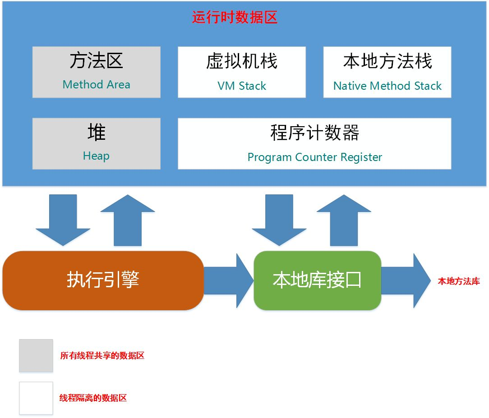
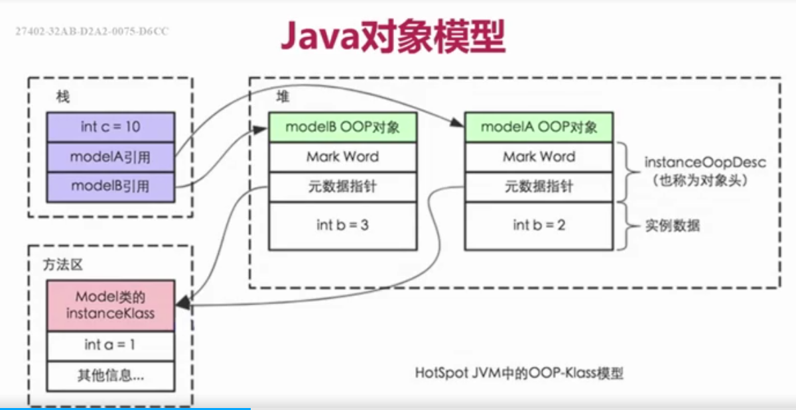

# java内存模型与线程
## 背景
  + 让计算机同时去做几件使用，不仅是计算机的算力提升了，还有一个原因:计算机的运算速度与它的存储和通信子系统的速度的差距太大。大量的时间都花费在磁盘I/O、网络通信或者数据库访问之上。如果不想处理器在大部分的时间里都处于等待其他资源的状态，就必须使用一些手段将处理器的运算能力压榨出来。
       - 进程在等待I/O，网络通信或者是访问数据库的时候，内核及时进行进程的调度，将那些不在等待io，网络通信，数据库访问的且需要cpu运算的进程进行调度，让它们去运行。当之前的进程的I/O，网络通信，数据库访问完成之后，内核及时将它们调度回来，进行余下的运算。这就会大大提高cpu的运算效率。
## 针对硬件效率的优化
- 高速缓存
  + 计算机的存储设备与处理器的运算速度有几个数量级别的差距，所以现代计算机在处理器和内存加入一层读写速度尽可能接近于处理器运算速度的高速缓存作为缓冲。--将运算需要使用到的数据复制到缓存中，让运算能快速进行;当运算结束后再从缓存中同步到主存之中;这样处理器就无需等待缓慢的内存读写了。
  + 缺点:
     1. 这会导致缓存不一致的问题(缓存一致性)
- 乱序执行(**指令重排**)
  + 为了是处理器内部的运算单元能够尽量被充分利用，处理器可能会对输入的代码进行乱虚执行优化。处理器会在处理之后将乱序执行的结果重组，保证该结果与顺序执行的结果一致
  + Java虚拟机的及时编译器中也有类似的指令重排优化
- 计算机级别的内存模型
   + <div> </div>

## Jvm内存结构 && Java对象模型 && Java 内存模型
### Jvm内存结构
+ 和java虚拟机的运行区域有关，例如 堆，栈。。。
+ 如图
   - 
### Java对象模型
+ 和java对象在jvm中的表现形式,即java对象自身的存储模型
+ 如图:
   - 
### Java 内存模型
#### 模型图
+ 图一
     -  

+ 图二 
     - 
#### 为什么需要JMM
1. C语言不存在内存模型的概念
2. 依赖于处理器，不同处理器结果不一样
    - CPU有多级缓存，导致读的数据过期
       + 高速缓存的容量比主存小，但是速度仅次于寄存器，所以cpu和主存之间就多了cache层
       + cpu缓存图 
3. 无法保证并发安全
4. 需要一个标准，让多线程运行的结果可以预期
#### 什么是JMM
+ 和java的并发编程有关
+ JMM是一种规范(确保在不同的jvm上有相同的效果，即标准的规范，自定义的实现)
+ 工具类和关键字的原理
   - volatile
   - synchronized
   - Lock
#### 重排序
+ 好处:提高处理速度,减少需要执行的指令
   - 
   - 如图，CPU指令优化之后，需要执行的指令数减少了
##### 重排的地方
1. 编译器优化，包括jvm，jit编译器等
2. CPU指令重排，即使编译器不发生重排，CPU也可能对指令进行重排
3. 内存的"重排序"：线程A的修改线程B却看不到，引出可见性问题
#### 代码示例
+ 如下代码x,y的值的情况右四种结果
    1. (x,y) => (0,1){a =1;x=b;b=1;y=a}
    2. (x,y) => (1,0){b=1;y=a;a=1;x=b;}
    3. (x,y) => (1,1){a=1;b=1;x=b;y=a;}
    ----------
    **以上三种情况考虑的是每个线程的代码是按照顺序执行的**
    ----------
    4. (x,y) => (0,0) {y=a;a=1;x=b;b=1;}
```java
  import java.util.concurrent.CountDownLatch;

     /**
     * 重排序 代码 12-1
     */
     public class OutOfOrderExecution {
     private static int a = 0, b = 0;
     private static int x = 0, y = 0;

     public static void main(String[] args) throws InterruptedException {
          CountDownLatch countDownLatch = new CountDownLatch(1);
          int i = 0;
          for (; ; ) {

               i++;
               a = 0;
               b = 0;
               x = 0;
               y = 0;

               Thread one = new Thread(new Runnable() {
                    @Override
                    public void run() {
                         try {
                         countDownLatch.await();
                         } catch (InterruptedException e) {
                         e.printStackTrace();
                         }
                         a = 1;
                         x = b;
                    }
               });

               Thread two = new Thread(new Runnable() {
                    @Override
                    public void run() {
                         try {
                         countDownLatch.await();
                         } catch (InterruptedException e) {
                         e.printStackTrace();
                         }
                         b = 1;
                         y = a;
                    }
               });

               one.start();
               two.start();
               countDownLatch.countDown();

               one.join();
               two.join();


               String result = "第" + i + "次 --- (x.y) = (" + x + "," + y + ")";
               System.out.println(result);
               if (x == 1 && y == 1) {
                    break;
               }

          }


     }
     }
```
#### 可见性
##### 示例代码
+ 可能出现的结果
   1. a=3  , b= 3
   2. a=3 , b= 1
   3. a=1 , b=2
   ---------
   4. a = 1  , b = 3  // b同步到了主存，a还没有同步到主存
+ 示例代码
```java
/**
 * 可见性
 */
public class FieldVidibility {

    private int a = 1;
    private int b = 2;

    public void change() {
        a = 3;
        b = a;
    }

    public void print() {
        System.out.println("a = " + a + "; b = " + b);
    }

    public static void main(String[] args) {
        while (true) {
            FieldVidibility fieldVidibility = new FieldVidibility();

            Thread one = new Thread(new Runnable() {
                @Override
                public void run() {
                    try {
                        Thread.sleep(100);
                    } catch (InterruptedException e) {
                        e.printStackTrace();
                    }

                    fieldVidibility.change();
                }
            });

            Thread two = new Thread(new Runnable() {
                @Override
                public void run() {
                    try {
                        Thread.sleep(100);
                    } catch (InterruptedException e) {
                        e.printStackTrace();
                    }

                    fieldVidibility.print();
                }
            });

            one.start();
            two.start();
        }

    }

}
```
##### 为什么会有可见性问题
1. CPU有多级缓存，导致读的数据过期
   +  高速缓存的容量比主存小，但是速度仅次于寄存器，所以cpu和主存之间就多了cache层
   + 线程间对共享变量的可见性问题不是直接由多核引起的，而是由多级缓存引起的
##### JMM主内存和本地内存(工作内存)
+ 这里的本地内存并不是一个真实的内存，而是一个抽象。是对寄存器，一级缓存，二级缓存等的抽象
###### 主内存和本地内存关系
1. 所有的变量都存储在主内存之中，同时每个线程也有自己独立的工作内存，工作内存中的变量内容是主内存中的**拷贝**
2. 线程不能直接读写主内存中的变量，而是只能操作自己工作内存中的变量，然后在同步到主内存中去
3. 主内存是多个线程共享的，但线程间不共享工作内存，若线程间需要通信，必须借助主内存中转来完成
4. 总结: 所有的共享变量都存在主存之中，每个线程有自己的本地内存，而且线程读写共享数据也是通过本地内存交换的，这个交换并不是实时的，所以才导致了可见性问题

#### Happens - before 规则
1. 单线程原则 
   + 在同一个线程内部，不论该线程内部是否发生重排序，后面的代码一定能够看到前面的代码的执行效果
2. 锁操作原则
   + 解锁之前的代码执行效果对于加锁之后的代码都是可见的
   + 
3. volatile变量
   + 只要这个变量被volatile修饰，线程A对这个变量修改了，那么线程B就立马可以看得到(内存屏障)
4. 线程启动
   + 子线程所有语句都能看到线程启动前父线程代码的执行结果 
5. 线程join
   + 一旦join之后，join之后的代码可以看到join之前代码的执行结果
6. 传递性
   + 若hb(a,b) 而且 hb(b,c) 则可以推出 hb(a,c)
     - 即 第一行代码的执行结果第二行代码可以看到，第二行代码的执行结果第三行代码可以看到。则第一行代码的执行结果第三行代码可以看到
7. 中断
   + 一个线程被其他线程interrupt时，那么检测中断(isInterrupt)或抛出InterruptedException一定能看到
8. 工具类的happens - before
    + 线程安全的容器get一定可以看到在此之前的put等存入操作
    + CountDownLatch
    + Semaphore
    + Future
    + 线程池
    + CyclicBarrier
#### Volatile 关键字
##### 是什么
+ volatile 是一种同步机制，比synchronized或者lock相关的类更轻量，因为使用volatile不会发生上下文切换等开销
+ 若一个变量被修饰为volatile，那么jvm就知道这个变量可能会被并发修改
+ 开销小，相应的能力也小。volatile无法做到sychronized那样的原子保护，volatile仅在有限的场景下才能发挥作用
   - 不适用：
        1. a++
        ```java
          /**
          * volatile 不适合的场景1：a++
          */
          public class NoneVolatile1 implements Runnable {

          public volatile int a = 0;
          public AtomicInteger realA = new AtomicInteger(0);

          public static void main(String[] args) throws InterruptedException {

               NoneVolatile1 noneVolatile1 = new NoneVolatile1();
               Thread thread = new Thread(noneVolatile1);
               Thread thread1 = new Thread(noneVolatile1);
               thread.start();
               thread1.start();
               thread1.join();
               thread.join();

               // a的值不一定是20000
               System.out.println("a: "+noneVolatile1.a);
               // realA的值一定会是 20000
               System.out.println("realA: "+noneVolatile1.realA);

          }

          @Override
          public void run() {
               for (int index = 0; index < 10000; index++) {
                    a++;
                    realA.incrementAndGet();
               }
          }
          }
        ```
   - 适用
        1. boolean flag; 若一个共享变量(不论类型)自始至终只被各个线程赋值，而没有其他的操作(比较，取反等)。那么就可以使用volatile来代替synchronized或者代替原子变量。因为赋值(不取决于之前的状态)自身是有原子性的，而volatile又保证的可见性，所以足以保证线程安全
        ```java
        /**
          * volatile适用场景: boolean flag
          */
          public class Volatile1 implements Runnable {
          public volatile boolean flag = false;
          public AtomicInteger count = new AtomicInteger(0);

          public static void main(String[] args) throws InterruptedException {

               while (true) {
                    Volatile1 volatile_ = new Volatile1();
                    Thread thread = new Thread(volatile_);
                    Thread thread1 = new Thread(volatile_);
                    thread.start();
                    thread1.start();
                    thread1.join();
                    thread.join();

                    System.out.println("a: " + volatile_.flag);
                    System.out.println("realA: " + volatile_.count);
               }

          }

          @Override
          public void run() {
               for (int index = 0; index < 10000; index++) {
                    setDone();
                    count.incrementAndGet();
               }
          }
          
          private void setDone() {
               /**
                 1. 这里是直接将flag设置为true(不论是什么类型，只要是直接赋值操作，没有其他的操作，例如对比，取值...，那么这种情况就适用于volatile)，并没有依赖与之前的状态
                 2. 并且使用了volatile来修饰flag，这保证了各个线程的可见性
                 3. 赋值本身就是原子性

                 综上三点，保证了线程安全
               */
               flag = true;
          }
          }
        ```
          + 非线程安全，flag变量依赖于之前的状态
              ```java
                  public class Volatile1 implements Runnable {
                    public volatile boolean flag = false;
                    public AtomicInteger count = new AtomicInteger(0);

                    public static void main(String[] args) throws InterruptedException {

                         //while (true) {
                              Volatile1 volatile_ = new Volatile1();
                              Thread thread = new Thread(volatile_);
                              Thread thread1 = new Thread(volatile_);
                              thread.start();
                              thread1.start();
                              thread1.join();
                              thread.join();

                              // 可能为false，可能为true
                              System.out.println("a: " + volatile_.flag);
                              // 一定是20000
                              System.out.println("realA: " + volatile_.count);
                         //  }

                    }

                    @Override
                    public void run() {
                         for (int index = 0; index < 10000; index++) {
                              setDone();
                              count.incrementAndGet();
                         }
                    }

                    private void setDone() {
                         /**
                            1. 在这里，flag依赖于之前的状态(会导致存在很多的动作，如从主存读入，取反操作，赋值，写入主存)，导致线程安全问题
                         */
                         flag = !flag;
                    }
               }
              ```
        2. 作为触发器使用，作为刷新之前变量的触发器作用
           ```java
           /**
               * volatile使用场景二: 触发器作用
               */
               public class Volatile2 implements Runnable {

               private int a = 9;
               private int b = 8;
               private int c = 7;
               /**
                 happens - before原则(单线程原则+volatile原则)
               */
               private volatile int d = 4;

               private void change() {
                    a = 100;
                    b = 200;
                    c = 300;

                    d = 0;
               }

               private void print() {
                    if (d == 0) {
                         System.out.println(String.format("a:%d , b:%d , c:%d , d:%d", a, b, c, d));
                    }
               }

               public static void main(String[] args) throws InterruptedException {
                    while (true) {
                         Volatile2 volatile2 = new Volatile2();
                         Thread thread = new Thread(volatile2);
                         Thread thread1 = new Thread(volatile2);

                         thread.start();
                         thread1.start();

                         thread.join();
                         thread1.join();
                    }
               }

               @Override
               public void run() {
                    change();
                    print();
               }
               }
           ```
##### 功能
1. 可见性
    + 读一个volatile变量之前，需要先使相应的本地缓存失效，这样就必须到主存中读取最新值，写一个volatile变量会先写入到工作内存并且立即刷入到主内存中
    + 其实：有了volatile关键字修饰的变量，赋值后多执行一个**lock addl $0x0 , (%esp)**操作，这个操作相当于一个 **内存屏障**，指令重排时不能把后面的指令重排到内存屏障之前的位置，只有一个CPU访问内存的时候，并不需要内存屏障；但如果两个或多个CPU访问同一块内存，且其中有一个在观测另外一个，就需要内存屏障来保证一致性了。
       - 且，对于**lock addl $0x0 , (%esp)**,这里的lock前缀，他的作用是使得本CPU的cache写入了内存，该写入的操作也会导致别的CPU或者别的内核其cache。
2. 禁止指令重排序
   + 普通变量仅仅会保证在该方法的执行过程中所有依赖赋值的地方都能获取到正确的结果，而不能保证变量赋值操作的顺序与程序代码执行的顺序一致。因为在一个线程方法执行过程中无法感知到这一点，这也就是java内存模型中的“**线程内表现为串行的语义**”
   + 代码12-1修正
     ```java
     import java.util.concurrent.CountDownLatch;

     /**
     * 重排序修正  volatile的使用
     */
     public class OutOfOrderExecution {
     private volatile static int a = 0, b = 0;
     private volatile static int x = 0, y = 0;

     public static void main(String[] args) throws InterruptedException {
          CountDownLatch countDownLatch = new CountDownLatch(1);
          int i = 0;
          for (; ; ) {

               i++;
               a = 0;
               b = 0;
               x = 0;
               y = 0;

               Thread one = new Thread(new Runnable() {
                    @Override
                    public void run() {
                         try {
                         countDownLatch.await();
                         } catch (InterruptedException e) {
                         e.printStackTrace();
                         }
                         a = 1;
                         x = b;
                    }
               });

               Thread two = new Thread(new Runnable() {
                    @Override
                    public void run() {
                         try {
                         countDownLatch.await();
                         } catch (InterruptedException e) {
                         e.printStackTrace();
                         }
                         b = 1;
                         y = a;
                    }
               });

               one.start();
               two.start();
               countDownLatch.countDown();

               one.join();
               two.join();

                // 使用volatile之后，就不会因为指令重排序导致x=0,y=0的情况了
               String result = "第" + i + "次 --- (x.y) = (" + x + "," + y + ")";
               System.out.println(result);
               if (x == 0 && y == 0) {
                    break;
               }

          }


     }
     }
     ```
##### 总结
1. volatile 关键字适用于一下场景
   + 某个属性被多个线程共享，其中有一个线程修改了此属性，其他线程可以立即得到修改后的值(且操作为赋值操作，没有其他的比较，运算等操作)
   + 作为触发器，实现轻量同步
2. volatile 属性的读写都是无锁的，他不能代替synchronized，因为他没有提供原子性和互斥性。因为无锁，不需要花费时间在获取锁和释放锁上---低成本
3. volatile只能修饰属性
4. volatile提供了可见性，只要写入，就会刷入主存;只要读取，也会总主存读取。
   + volatile修饰的变量的读写相当于是直接与主存交互
5. volatile提供了happens-before保证，对volatile变量v的写入happens-before所有其他线程后序对v的读操作
6. volatile可以使得long&&double的赋值是原子的
##### synchronized
1. synchronized 不仅保证了原子性，还保证了可见性
2. 借助于happends-before原则，会让被synchronized保护的代码之前的代码也可见
#### 原子性
##### 什么是原子性
+ 一系列的操作，要么全部执行成功，要么全部不执行成功，不会出现执行一半的情况，是不可分割的。
##### java中的原子性
1. 除了long和double之外的基本类型的赋值操作
2. 所有引用reference的赋值操作，不管是32位还是64位的机器
3. java.concurrent.Atomic.*包中所有类的原子操作
##### long,double的原子性
+ 在32位的jvm上，long和double的操作不是原子的，但是在64位的机器上是原子的
#### 单例模式
##### double-check模式的单例模式
+ 代码
```java
     /**
     * 双重锁校验的单例模式
     */
     public class SingletonDoubleCheck {

     /**
          * 单例对象 ， 注意，这里需要使用volatile修饰
          */
     private static volatile SingletonDoubleCheck singletonDoubleCheck;

     /**
          * 单例模式，构造方法私有化
          */
     private SingletonDoubleCheck() {

     }

     /**
          * 获取单例对象方法
          *
          * @return 单例对象
          */
     public static SingletonDoubleCheck getInstance() {

          if (null == SingletonDoubleCheck.singletonDoubleCheck) { // 第一重校验
               synchronized (SingletonDoubleCheck.class) {
                    if (null == SingletonDoubleCheck.singletonDoubleCheck) { // 第二重校验
                         SingletonDoubleCheck.singletonDoubleCheck = new SingletonDoubleCheck();
                    }
               }
          }

          return SingletonDoubleCheck.singletonDoubleCheck;

     }

     }
```
###### 解释，这里仅解释为什么使用volatile修饰单例对象，其他的(双重锁谁不知道呢?)
+ 因：因为jmm的模型(分为工作内存和主存)且jvm创建对象并不是原子操作(见上，jvm中的原子操作)。jvm创建对象分为三步
    1. 创建空的对象
    2. 执行构造函数
    3. 将对象地址赋值给引用变量
+ 故：
   1. 因为存在指令重排序的存在，这三个步骤的顺序不是固定的，这会造成问题。而volatile就禁止了指令重排，从而避免了这个问题
   2. volatile的另一个作用就是**可见性**，这就保证了在一个线程中执行之后在其他线程中是可见的。