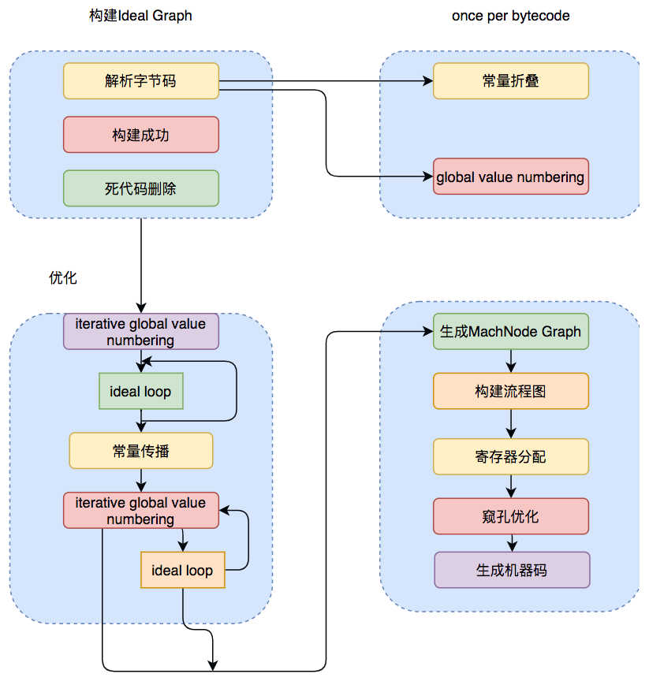

# 02.Java及时编译器原理解析及实战
## 背景
&nbsp;&nbsp;为了优化Java的性能，JVM解释器之外引入了即时（Just In Time）编译器：当程序运行的时，解释器首先发挥作用，代码可以直接运行.随着时间推移，即时编译器逐渐发挥作用，把越来越多的代码编译优化为本地代码，来获取更高的执行效率。解释器这时候可以**作为编译运行的降级手段**,在一些不可靠的编译优化出现问题的时候，再切换为解释执行，保证程序可以正常运行。
&nbsp;&nbsp;即时编译器极大提高了Java程序的运行速度，而且和静态编译相比，即时编译器可以选择性的编译热点代码，省去了很多编译时间，也节省了很多空间。
   - 即： 代码优先解释执行  -> 即时编译器优化之后，本地代码执行 -> 当出现编译优化问题时，回到解释执行
## Java的执行过程
&nbsp;&nbsp;Java的执行过程可以分为两个部分：
1. 第一步由javac将源代码便以为字节码，在这个过程中会进行 词法分析、语法分析、语义分析，编译原理中这部分编译称为**前端编译**。
2. 接下来并不需要编译直接逐条将字节码解释执行，在解释执行的过程中，虚拟机同时对程序运行的信息进行收集，在这些信息的基础上，即时编译器会逐渐发挥作用，他会进行**后端编译**---即将字节码编译为机器码，但不是所有的代码都会被编译，只有被JVM认定为的热点代码才可能被编译。
    - 遗留的一个问题? 什么是热点代码
       + 见 附录-01
## 01. JVM中的JIT(即时编译器)
&nbsp;&nbsp;JVM中集成了两种编译器，Client Compiler 和 Server Compiler，他们的作用也不一样。
   - Client Compiler注重启动速度和局部的优化
   - Server Compiler则更加注重全局的优化，性能会更好，但由于会进行更多的全局分析，所以启动速度会变慢。
&nbsp;&nbsp;两种编译器有着不同的应用场景，在虚拟机中同时发挥作用
### 01-01.Client Compiler(客户端编译器)
- 
&nbsp;&nbsp;HotSpot VM带有一个Client Compiler ，简称为C1编译器。这种编译器启动速度快，但是性能比较Server Compiler来说会差一些。C1会做以下三件事:
1. 局部简单可靠的优化，比如字节码上进行的一些基础优化，方法内联、常量传播等，放弃许多耗时较长的全局优化。
2. 将字节码构造成高级中间表示(High-level Intermediate Representation，以下称为HIR),HIR与平台无关，通常采用图结构，更适合JVM对程序进行优化
3. 最后将HIR转换为低级中间表示(Low-level Intermediate Representation，以下称为LIR),在LIR的基础上会进行寄存器分配、窥孔优化(局部的优化方式，编译器在一个基本块或者多个基本块中，针对于已经生成的代码，集合CPU自己指令的特点，通过一些认为可能带来性能提升的转换规则或者通过整体的分析，进行指令的转换，来提升代码性能)等操作,最终生成机器码。

### 01-02.Server Compiler(服务端编译器)
&nbsp;&nbsp;Server Compiler主要关注一些编译比较耗时的全局优化，甚至还会根据程序运行的信息进行一些不可靠的激进优化。这种编译器的启动时间长，适用于长时间运行的后台程序，他的性能通常比Client Compiler高30%以上。目前，在HotSpot虚拟机中使用的Server Compiler有两种：
- C2
- Graal
#### 01-02-1. C2
&nbsp;&nbsp;在HotSpot VM中，默认的Server Compiler是C2编译器。
&nbsp;&nbsp;C2编译器在进行编译优化的时候，会使用一种控制流与数据流结合的图数据结构，称为Ideal Graph。Ideal Graph表示当前程序的数据流向和指令间的依赖关系，依靠这种图结构，某些优化步骤(尤其涉及到浮动代码块的那些优化步骤)变得不那么复杂。
+ Ideal Graph的构建是在解析字节码的时候，根据字节码中的指令向一个空的Graph中添加节点，Graph中的节点通常对应一个指令块，每个指令块包含多条相关联的指令，JVM会利用一些优化技术对这些指令进行优化，例如 Global Value Number 、 常量折叠等，解析结束之后，还会进行对一些死代码剔除的操作。生成Ideal Graph后，会在这个基础上结合收集的程序的运行信息来进行一些全局的优化，这个阶段如果JVM判断此时没有全局优化的必要，就会跳过这部分优化。
&nbsp;&nbsp;无论是否进行全局优化，Ideal Graph都会被转化为一种更接近机器层面的MachNode Graph，最后，编译的机器码就是从MachNode Graph中得的，生成机器码前还会有一些包括寄存器分配、窥孔优化等操作。Server Compiler 编译优化步骤如下图所示:
   - 

## 附录
### 01.什么是热点代码
&nbsp;&nbsp;怎么样才会被认定为是热点代码呢? JVM中会设置一个阈值，当方法或者代码块在一段时间内的调用次数超过这个阈值就会被编译，**存入codeCache**中。当下次执行时，在遇到这一段代码,就会**从codeCache中读取机器码**,直接执行，以此来提升程序运行的性能。整个执行过程大致如下:
  - 
